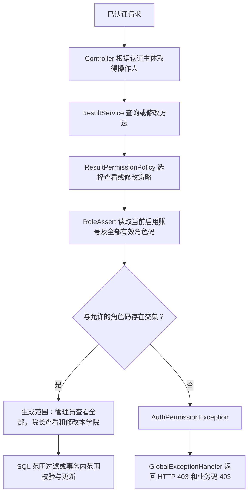

# T-05 / T-06 权限校验空指针与角色判定口径不统一 —— 完整解决方案

> 对应问题：[项目TODO清单分析与解决方案.md](./项目TODO清单分析与解决方案.md) 中 **T-05 / T-06【P1】**
> 结构参考：[T-02-OA接口密钥明文硬编码-完整解决方案.md](./T-02-OA接口密钥明文硬编码-完整解决方案.md)
> 原 TODO 位置：`ResultServiceImpl.java:214 / :234`；当前代码位置：**`:254 / :274`**（代码迭代后行号已变化）
> 关联任务卡：**IMP-04** 的结果查询/评分权限部分，并处理 **R-01** 在这些入口上的影响
> 计划编写时间：2026-10-02
> 本文状态：**仅计划，未实施；本次仅修订本文档，不修改任何业务代码、配置或数据库**
> 方案修订：2026-10-02，根据当前代码收敛角色矩阵、学院范围、账号状态、旧接口兼容及验证方式；以下为唯一推荐实施方案
> 数据库变更：**原则上无 DDL，复用现有 `sys_role.role_code`**；环境数据核对及可能的订正见第四节
> 验证状态：已静态阅读当前仓库；本文中的代码、SQL、构建命令和验收用例均为**实施建议，尚未执行**

---

## 一、问题定性

这两个 TODO 属于同一组权限缺陷，应合并治理：**角色查询允许返回空值，授权逻辑却直接解引用；同时把角色显示名称和“最高权重角色”当成授权依据，导致相同业务入口的判断不一致。**

只补一个 `role != null` 可以止住部分异常，但不能解决角色改名、多角色、同权重以及新旧接口授权差异。完整方案应建立可复用的有效角色校验，并把查看和修改的业务规则写成明确的权限策略。

### 1.1 当前代码的问题链

以下片段来自当前仓库，省略了查询和结果组装部分：

```java
// T-05：ResultServiceImpl#getList，当前 TODO 在第 254 行
Integer userId = user.getUserId();
//TODO 只有院长才能查看和修改
Role role = userRoleMapper.getRoleWeight(userId);
if (!HnkjzyEncode.DEAN.getName().equals(role.getRoleName())) {
    throw new RuntimeException("该列表只有院长可以查看");
}

// T-06：ResultServiceImpl#getLists，当前 TODO 在第 274 行
Integer userId = user.getUserId();
//TODO 只有院长才能查看和修改
Role role = userRoleMapper.getRoleWeight(userId);
if (!role.getRoleName().equals(HnkjzyEncode.ADMIN.getName())) {
    if (!HnkjzyEncode.DEAN.getName().equals(role.getRoleName())) {
        throw new RuntimeException("该列表只有院长可以查看");
    }
}
```

`UserRoleMapper#getRoleWeight` 当前 SQL：

```sql
select * from sys_role
where role_status = 1
  and role_id in (
      select role_id from sys_user_role where user_id = #{userId}
  )
order by weight desc
limit 1
```

| 环节 | 当前问题 | 具体后果 |
|---|---|---|
| `user.getUserId()` | Service 假定用户对象一定存在 | Controller 以外的调用若传入空用户，仍会 NPE；空 `userId` 也未明确处理 |
| 查询角色 | 没有有效角色时返回 `null` | `role.getRoleName()` 必然 NPE，无法给出明确的无权限提示 |
| 获取名称 | T-06 用 `role.getRoleName().equals(...)` | 即使 `role` 存在，异常数据中的空名称也可能 NPE；T-05 的常量侧 `equals` 只能防住名称为空，防不住角色为空 |
| 只取一条 | `order by weight desc limit 1` | 用户持有院长和其他角色时，合法的院长角色可能被忽略 |
| 权重相同 | 院长与书记均为 9，SQL 未提供同权重次序 | 同时持有二者时，被选中的角色没有稳定保证，判定可能随数据库执行情况变化 |
| 按名称授权 | 用“院长”“超级用户”字符串比较 | 改显示名称会使合法权限失效；把其他角色名称改成“院长”也会影响判断 |
| 新旧接口 | 旧查询仅允许院长，新查询允许超级用户或院长 | 同一成绩查询功能可能因调用不同接口而得到不同的权限结果 |
| 注释与实现 | 两处均写“查看和修改”，实际只查询 | 无法从注释准确判断修改权限，容易把查看策略误用于写入 |
| 异常处理 | 抛通用 `RuntimeException` | 权限不足、空指针和普通参数错误进入同一个兜底处理器，前端难以区分 |

**触发空角色的典型情况**：账号未分配角色、所有关联角色被停用或逻辑删除、关联角色记录已不存在。仅持有一个启用的普通用户角色通常不会返回空角色，但仍应按权限不足处理。

### 1.2 当前响应并非必然 HTTP 500

TODO 总清单将 NPE 的后果概括为“接口返回 500”。当前仓库已经存在 `GlobalExceptionHandler`，其中：

```java
@ExceptionHandler(RuntimeException.class)
public ApiResult handler(RuntimeException e) {
    e.printStackTrace();
    System.out.println(e.getMessage());
    return ApiResult.error(400, e.getMessage());
}
```

NPE 也是 `RuntimeException`。在异常进入该 MVC 处理器、且响应未提前提交的通常路径上，**返回体业务码为 400，HTTP 状态通常仍为 200**，因为这里没有设置 HTTP 状态。是否存在绕过该处理器而返回 500 的部署路径，需要运行验证。

因此，本方案的准确目标是：**权限不足返回明确的 HTTP 403 和业务码 403，不再产生空角色解引用，也不再把授权失败包装成普通参数错误。**不能仅通过断言“没有 500”来验收。

### 1.3 角色身份、显示名称、权重必须分开

当前 `Role` 实体已经有 `roleId / roleName / roleCode / roleStatus / weight`，其中 `roleCode` 注释为“角色唯一编码”。`all.sql` 的 `sys_role` 定义也已经包含 `role_code` 及其唯一索引。

仓库 SQL 快照中的示例数据：

| 角色 | `role_id`（仅作证据） | `role_code` | 数据权重 | `HnkjzyEncode` 权重 |
|---|---|---|---|---|
| 超级用户 | 2 | `admin` | 10 | 100 |
| 院长 | 8 | `dean` | 9 | 9 |
| 书记 | 17 | `clerk` | 9 | 9 |
| 教研室主任 | 3 | `director` | 5 | 5 |
| 普通用户 | 1 | `normal` | 1 | 1 |

> 证据位置：`soft_main/src/sql/all.sql:19095` 起的表结构与 `:19112` 起的角色数据。SQL 文件是仓库快照，**不能替代 dev/test/prd 真实数据库核对**。不得把表中的角色 ID 写死到授权逻辑中。

这说明直接采用 TODO 清单中的“按权重授权”示例有两个问题：

1. `weight=9` 无法区分 `dean` 和 `clerk`，会把书记误当成院长；
2. 枚举的 `ADMIN.getCode()` 是权重 100，而 SQL 快照中的管理员权重为 10，按枚举权重匹配可能错误拒绝管理员。

**本方案采用现有 `role_code` 精确判定身份，权重仅保留给既有排序或业务层级用途。**不新增重复的角色码字段，不修改 `HnkjzyEncode` 的数值来绕过问题。

### 1.4 实际影响入口

当前 dev/test/prd 配置均为 `context-path: /api`。下表给出外部完整路径；Controller 注解中的路径不包含 `/api`。

| 范围 | HTTP 接口 | Service 方法及当前位置 | 当前允许规则 |
|---|---|---|---|
| T-05 | `GET /api/project/subTaskScore` | `getList`，`:250` 起 | 最高权重角色名称为“院长” |
| T-06 | `GET /api/project/subTaskScores` | `getLists`，`:270` 起 | 最高权重角色名称为“超级用户”或“院长” |
| 同源修改入口 | `PUT /api/project/subTaskScore` | `updateSubTaskScore`，`:532` 起 | 最高权重角色名称为“院长”，同样存在空指针 |

旧查询 Controller 文档已标注“已废弃”，但当前仍保留接口及 Service 实现，不能因已废弃而遗漏修复。

**对原清单的补充核对**：当前 `getLists` 的 `userId` 实际用于 `getRoleWeight(userId)`，并非未使用；而且“修改”确实有独立入口 `updateSubTaskScore`，不需要凭空新增一个修改接口。该入口应作为同源修复纳入计划。

### 1.5 本次复查发现的落地前提

| 代码证据 | 发现 | 本方案的处理结论 |
|---|---|---|
| `User.java` 的 `status / college`；`all.sql` 的 `sys_user` 定义 | 已有账号启用状态和学院字段，无需新增组织表即可实施按当前所属学院过滤 | 院长仅查看/修改本学院教师成绩，管理员可查看全部学院 |
| `ProjectServiceImpl#getProjectAssessList` 的院长分支 | 注释明确要求查看“该二级学院下”的数据，当前实现尝试通过共同角色过滤 | 采用学院边界作为成绩访问范围；不照搬共享角色判断，因为共享 `dean` 本身不能证明同学院 |
| `CheckResultServiceImpl`、`ScheduleController` 的 `user.getCollege()` 过滤 | 项目已有按用户学院隔离的实现惯例 | 使用数据库中的操作人学院和成绩所属用户学院，禁止从请求传入授权范围 |
| `AuthController#/edit/user` 与 `/user/update` | 普通资料修改只设置邮箱和手机号；用户管理修改由 `hasRole('admin')` 保护 | 学院来自后台账户管理资料；读取当前库值，避免使用缓存或请求快照 |
| `UserServiceImpl#getUserByName` 的 `@Cacheable` | Controller 得到的用户可能是旧快照 | Guard 通过 `UserMapper` 重新读取当前账号，不使用缓存中的 `status/college` 授权 |
| `JwtAuthenticationFilter` 普通用户分支 | 查询用户及 token 后未检查 `user.status=1` | 本次三个 Service 入口补充启用状态校验，不假定 JWT 已处理账号禁用 |
| `Task.java` 与 `all.sql` 的 `sys_task` 定义 | 均不存在 `selectTaskByProjectAndTeacher` 字段，真实主键是 `id` | 旧查询连接条件是明确的仓库代码/表结构不一致，修正为 `a.task_id=c.id`，纳入本次接口闭环 |
| `soft_main/pom.xml` 的 Surefire 配置与 `TestMain.java` | 测试默认硬编码跳过；旧测试含本机 Excel 路径和数据库导入 | 将跳过配置参数化，明确只运行本次新增测试，不能用普通 `mvn test` 的成功作为验证证据 |

以上学院边界是结合现有模型、相邻业务约束和最小权限原则选定的**方案决策**，不声称当前这两个接口已经实现学院隔离；角色码和运行环境的数据仍需实施时只读检查，不能将仓库静态核对写成生产环境验证结果。

---

## 二、解决方案设计

整体采用：**重新读取启用账号 → 查询全部有效角色码 → 生成受信任的操作范围 → 查询与写入同时落实学院边界 → 专用异常返回正确 HTTP 状态**。



### 防线 1：确定唯一权限矩阵，查看与修改分开

**本计划确定采用以下矩阵，不保留新旧接口两套授权口径。**以 Controller 推荐的新查询为查看规则基准，旧查询保留路径与参数兼容，并采用相同查看规则；修改保留现有“院长评分”职责。

| 有效角色 | 旧查询 `getList` | 新查询 `getLists` | 修改 `updateSubTaskScore` |
|---|---|---|---|
| `dean` | 允许，仅本学院 | 允许，仅本学院 | 允许，仅本学院 |
| `admin` | 允许，全部学院 | 允许，全部学院 | 拒绝 |
| `admin + dean` | 允许，全部学院 | 允许，全部学院 | 允许，但仍仅本学院 |
| `clerk` | 拒绝 | 拒绝 | 拒绝 |
| `director / normal / student` 等 | 拒绝 | 拒绝 | 拒绝 |
| 无任何有效角色 | 拒绝 | 拒绝 | 拒绝 |

决策依据：`getLists` 已允许管理员查看，旧接口注释明确推荐新接口，因此将同一查询能力统一到新规则；`updateSubTaskScore` 只允许院长，故管理员不自动获得评分权。当前没有书记独立访问这三个入口的代码依据，因此 `clerk` 明确拒绝，不能利用同权重推导权限。

多角色采用“**持有任一允许的有效角色即可**”，但数据范围按操作确定：查看时有效 `admin` 可获得全学院范围；修改必须持有有效 `dean`，即使同时持有 `admin` 也只能修改本学院。院长兼任书记或更高权重职务不会丢失院长身份。

这是计划中明确的行为调整：管理员可访问旧查询；原本被最高角色遮蔽的院长可正常操作；院长查询和评分由当前未限制的范围收紧到本学院。实施与验收按这一矩阵执行，不再回退到“待确认”的双方案。

### 防线 2：查询全部有效角色，不再取最高权重单角色

在 `UserRoleMapper` **新增专用查询**，不改变已有 `getRoleWeight / getRoles / selectRoleByUserId` 的语义，避免影响审批、首页等其他调用方。

```java
// 计划示例：UserRoleMapper 中新增；并非已写入代码
@Select("SELECT DISTINCT r.role_code " +
        "FROM sys_role r " +
        "INNER JOIN sys_user_role ur ON ur.role_id = r.role_id " +
        "WHERE ur.user_id = #{userId} " +
        "AND r.role_status = 1 " +
        "AND r.role_code IS NOT NULL " +
        "AND TRIM(r.role_code) <> ''")
List<String> selectActiveRoleCodes(@Param("userId") Integer userId);
```

约束：

- 显式过滤 `role_status=1`。自定义注解 SQL 不能假定自动获得 MyBatis-Plus 逻辑删除条件；当前配置的有效值为 1、删除值为 0。
- 使用 `DISTINCT` 去重，不依赖角色记录或关联记录的顺序。
- 没有角色返回空集合；Guard 仍对意外空集合引用做防御。
- 数据库执行失败应继续抛出原异常，**不能 catch 后当成无角色，更不能放行**。
- 不缓存该查询的结果，让停用角色或移除关联在后续请求中按当前数据库状态生效；事务内已经开始的操作不承诺被追溯撤销。

### 防线 3：使用已有角色码，默认拒绝，杜绝名称和权重回退

新增 `RoleCodes` 常量类，值使用三个仓库 SQL 快照一致的小写编码：

```java
// 计划示例：放在 soft_common/constant/RoleCodes.java
public final class RoleCodes {
    public static final String ADMIN = "admin";
    public static final String DEAN = "dean";

    private RoleCodes() {
    }
}
```

`clerk` 不在允许集合中，因此书记不能因为同权重而获得院长权限。名称变更不影响授权；角色码变更则属于身份变更，需要经过角色管理流程和回归验证。

采用**大小写敏感的完整字符串匹配**，不做 `contains`、前缀匹配、转小写或自动修剪后放行。`DEAN`、`dean `、`dean_test` 均不等于 `dean`；不规范数据先核对订正，不能用宽松匹配隐藏问题。

### 防线 4：抽取统一 RoleAssert，放在正确的模块

`RoleAssert` 需要访问 `UserRoleMapper` 和 `User`，应放在 **`soft_service`**，而不是照抄总清单示例将依赖 Mapper 的 Bean 放进基础模块。

依赖方向保持：`soft_main → soft_service → soft_mapper / soft_common`。基础角色常量和专用异常可以放 `soft_common`，但不让 `soft_common` 反向依赖 Mapper 或 Service。

核心流程如下。`ActiveRoles` 是 `RoleAssert` 的内部不可变返回类型，保存当前数据库用户和有效角色码集合；不是请求 DTO。示例省略其构造器、getter 和 imports：

```java
@Component
public class RoleAssert {
    private final UserRoleMapper userRoleMapper;
    private final UserMapper userMapper;

    public RoleAssert(UserRoleMapper userRoleMapper, UserMapper userMapper) {
        this.userRoleMapper = userRoleMapper;
        this.userMapper = userMapper;
    }

    public ActiveRoles requireAnyOf(User operator, String... allowedCodes) {
        if (operator == null || operator.getUserId() == null
                || operator.getUserName() == null) {
            throw new AuthPermissionException(401, "当前登录身份无效，请重新登录");
        }

        // 直接调用 Mapper，不经过 getUserByName 的用户缓存。
        User current = userMapper.selectById(operator.getUserId());
        if (current == null || !Integer.valueOf(1).equals(current.getStatus())
                || !Objects.equals(current.getUserName(), operator.getUserName())) {
            throw new AuthPermissionException(401, "认证用户无效或已禁用，请重新登录");
        }

        List<String> codes = userRoleMapper.selectActiveRoleCodes(current.getUserId());
        if (codes == null || codes.isEmpty()) {
            throw new AuthPermissionException(403,
                    "当前账号未分配有效角色，请联系管理员");
        }

        boolean permitted = allowedCodes != null && Arrays.stream(allowedCodes)
                .filter(Objects::nonNull)
                .anyMatch(codes::contains);
        if (!permitted) {
            throw new AuthPermissionException(403, "无权限执行该操作");
        }
        return new ActiveRoles(current, new HashSet<>(codes));
    }
}
```

- 用户对象和 `userId` 在解引用、查库前校验。
- 无角色、全部停用、仅有不允许角色均拒绝，不以普通用户、管理员或其他身份兜底。
- 允许集合意外为空也拒绝，避免策略漏配造成放行。
- 前端 DTO 中的 `userId` 是查询/评分目标用户，**不能用来识别操作人**。操作人仍来自 Controller 的认证主体。
- Guard 额外校验数据库当前账号的 `status=1`，以修补 JWT 普通用户分支未检查禁用状态的问题；只覆盖本次三个入口，不宣称全站登录体系已完成修复。
- 操作人 ID/用户名应来自认证链路，数据库复查只验证和补充身份信息，不能把客户端传入的用户对象当成可信身份。
- 当前用户与角色查询不启用二级缓存；授权按读取时的状态判断，后续请求读取最新已提交状态，不承诺撤销已经开始的事务。

### 防线 5：集中查看和修改策略，同源修改入口同步接入

新增 `ResultPermissionPolicy`，返回不可变的 `ResultAccessScope`，把角色规则与数据范围一并集中。范围类型放在 `soft_model`，便于 Mapper 使用，不引入 `soft_mapper → soft_service` 的反向依赖。

`ResultAccessScope` 包含 `operatorId / allColleges / college`，只允许服务端通过 `all(operatorId)` 和 `college(operatorId, college)` 工厂构造。学院范围的工厂拒绝空值、全空白和首尾空格；不允许“学院为空即全校”的隐式规则。

```java
@Component
public class ResultPermissionPolicy {
    private final RoleAssert roleAssert;

    public ResultPermissionPolicy(RoleAssert roleAssert) {
        this.roleAssert = roleAssert;
    }

    public ResultAccessScope requireView(User operator) {
        RoleAssert.ActiveRoles active = roleAssert.requireAnyOf(
                operator, RoleCodes.DEAN, RoleCodes.ADMIN);
        if (active.getCodes().contains(RoleCodes.ADMIN)) {
            return ResultAccessScope.all(active.getUser().getUserId());
        }
        return requireCollegeScope(active.getUser());
    }

    public ResultAccessScope requireEdit(User operator) {
        RoleAssert.ActiveRoles active = roleAssert.requireAnyOf(operator, RoleCodes.DEAN);
        return requireCollegeScope(active.getUser());
    }

    private ResultAccessScope requireCollegeScope(User current) {
        String college = current.getCollege();
        if (college == null || college.trim().isEmpty()
                || !college.equals(college.trim())) {
            throw new AuthPermissionException(403, "当前账号学院配置不完整，请联系管理员");
        }
        return ResultAccessScope.college(current.getUserId(), college);
    }
}
```

实施时接入位置：

```java
// getList / getLists：先授权，再将服务端 scope 传给 Mapper 并组装 total/list
ResultAccessScope scope = resultPermissionPolicy.requireView(user);

// updateSubTaskScore：先授权，再执行原参数校验、锁和范围校验，最后写入
ResultAccessScope scope = resultPermissionPolicy.requireEdit(user);
```

两个查询统一调用 `requireView`，修改统一调用 `requireEdit`；不新增 `requireLegacyView`，不保留名称或权重判断的兼容后门。

三个 Service 方法的权限检查都要位于**业务查询或写入前**。授权拒绝时，不查询成绩，不取得后续业务锁，不执行评分更新。移除旧的名称判断和含混 TODO，改为“校验子任务成绩查看权限”“校验子任务成绩修改权限”等准确注释。

**保留当前评分方法的事务与 T-04 防护**：`@Transactional`、`READ_COMMITTED`、真实任务归属核对、项目升序加锁、结果有效性复查以及批量更新均不应被替换。权限异常继承 `RuntimeException`，保持现有事务回滚机制。

### 防线 5.1：两个查询都在 SQL 中落实学院范围，修复旧查询连接

当前成绩记录以 `sys_result.u_id` 指向用户，查询已有别名 `d` 对应 `sys_user`；用该用户的 `college` 过滤即可，不需要从项目推断学院。项目可跨学院，不能只按项目创建者学院授权。

计划修改 `ResultMapper` 的两个查询签名：旧查询在现有命名参数后增加 `@Param("scope") ResultAccessScope scope`；新查询改为 `@Param("dto") SubTaskIdDto dto, @Param("scope") ResultAccessScope scope`。XML 相应将新查询条件改为 `dto.projectId / dto.userId / ...`，移除不匹配实际参数的 `parameterType="java.lang.String"`。

两条查询的 `<where>` 均包含同一范围片段：

```xml
<!-- 计划示例：缺少范围时查询 0 行，不因漏传而查全校。 -->
<sql id="resultAccessScope">
    <choose>
        <when test="scope != null and scope.allColleges">
            AND 1 = 1
        </when>
        <when test="scope != null and scope.college != null and scope.college != ''">
            AND BINARY d.college = BINARY #{scope.college}
        </when>
        <otherwise>
            AND 1 = 0
        </otherwise>
    </choose>
</sql>
```

- 学院采用精确匹配，`BINARY` 避免仓库表的大小写不敏感排序规则产生与 Java 不一致的范围判断；不使用模糊包含或学院别名自动扩权。
- 院长跨学院的列表查询返回正常空结果 `total=0/list=[]`，包括指定其他学院目标 `userId` 的查询；不通过响应泄露目标是否存在。
- 院长不能查看学院缺失的目标用户；管理员全学院查看可看到这些历史记录，以便排查。修改仍要求目标学院与院长学院一致。
- 旧接口保留现有字段集合、名称筛选及 `total/list` 结构；新接口保留现有字段与筛选。范围过滤在 SQL 内执行，不在返回后再做内存过滤。
- 两条查询统一使用 `a.task_id=c.id AND c.p_id=b.id` 的任务连接，保证结果、任务和项目一致。旧 SQL 的 `c.selectTaskByProjectAndTeacher` 在实体和快照结构中均不存在，是本次明确修复项，不再作为悬而未决的疑点。
- 不删除旧 GET，不改为 HTTP 重定向；它已废弃但仍是现有可调用接口，保留兼容最稳妥。

### 防线 5.2：批量评分校验全量目标，范围拒绝整批回滚

角色检查通过后，沿用现有参数校验和项目锁，再增加用户学院范围保护：

1. 在任何写入前校验整个 DTO 列表及元素、解析全部目标 ID，保留现有任务/项目真实性核对。
2. 按当前 T-04 规则，对全部真实项目 ID **升序取得项目锁**；不改成按客户端遍历顺序加锁。
3. 对目标用户 ID 去重并升序排列，新增 `lockScoreTargetUser(targetId)` 查询，**按升序逐条**读取 `user_id/college` 并 `FOR UPDATE`，全批次固定“项目锁 → 目标用户锁”顺序。逐条锁定避免依赖 `IN (...) ORDER BY` 的执行计划来保证实际加锁顺序。结果用户可处于历史停用状态，目标状态不作为本次新增过滤；操作人必须启用。
4. 每个目标用户都必须存在并与 `scope.college` 精确一致；缺失用户沿用失效结果语义，学院不匹配或缺失抛专用 403。若任一项不满足，**整批拒绝，不筛掉越界项后部分更新**。
5. 保留已有结果存在性/任务归属复查，再执行带学院条件的更新 SQL；更新语句通过 `sys_user` 关联再次限定学院，范围为空直接拒绝执行。
6. 用户行锁持有至评分事务结束，避免范围校验后管理员并发调整目标用户学院造成检查与写入不一致；该保证限于本事务及遵循数据库行锁的更新，不扩展为全站组织冻结。

目标用户锁定 SQL 与更新 SQL 计划形态（参数绑定与原批量循环适配）：

```sql
-- Service 对去重后的目标 ID 升序逐条调用，在原评分事务内执行。
SELECT user_id, college FROM sys_user WHERE user_id = #{targetId} FOR UPDATE;

UPDATE sys_result a
INNER JOIN sys_user d ON d.user_id = a.u_id
SET a.score = #{row.score}
WHERE a.u_id = #{row.userId}
  AND a.p_id = #{row.projectId}
  AND a.task_id = #{row.taskId}
  AND BINARY d.college = BINARY #{scope.college}
```

需要改造 `updateBySubTaskName` 的 Java/XML 命名参数及 `<foreach collection="rows" item="row">`，同步唯一调用点；不只是给 Service 增加检查后继续调用无范围 SQL。**不要用“更新影响行数必须等于列表长度”验证成功**，同分数重复提交可能是合法无变化更新；匹配范围和结果存在性应在锁内先验证，SQL 执行异常仍整批回滚。

### 防线 6：专用异常映射真正的 HTTP 401/403

新增 `AuthPermissionException`，携带 `status`（仅使用 401/403）与可读提示。不要复用项目任务导入专用的 `ProjectTaskException`，也不要假定仓库已有 `BusinessException`。

在已有 `GlobalExceptionHandler` 中新增具体处理器：

```java
// 计划示例；status 由 AuthPermissionException 限定为 401 或 403
@ExceptionHandler(AuthPermissionException.class)
public ResponseEntity<ApiResult> handler(AuthPermissionException e) {
    return ResponseEntity.status(e.getStatus())
            .body(ApiResult.error(e.getStatus(), e.getMessage()));
}
```

响应约定：

| 情况 | HTTP 状态 | 响应体 | 行为 |
|---|---|---|---|
| 已进入 Controller/Service，但操作人为空或缺少 ID | 401 | `{"code":401,"msg":"当前登录身份无效，请重新登录"}` | 终止查询或更新 |
| 数据库账号不存在、已禁用或 ID/工号不一致 | 401 | `{"code":401,"msg":"认证用户无效或已禁用，请重新登录"}` | 不依赖缓存账号快照放行 |
| 已认证，未分配有效角色 | 403 | `{"code":403,"msg":"当前账号未分配有效角色，请联系管理员"}` | 不返回成绩、不写数据 |
| 有有效角色但不在当前操作允许集合 | 403 | `{"code":403,"msg":"无权限执行该操作"}` | 不返回成绩、不写数据 |
| 院长学院配置缺失或不规范 | 403 | `{"code":403,"msg":"当前账号学院配置不完整，请联系管理员"}` | 禁止省略范围条件查全校 |
| 批量修改包含其他学院目标 | 403 | `{"code":403,"msg":"无权限修改其他学院成绩"}` | 整批回滚 |
| 允许访问 | 200 | 沿用现有成功结构 | 查询仍为 `data.total / data.list`，修改仍为“修改成功” |

三个目标 Controller 方法当前都有“用户不能为空”的通用异常。实施时应替换为同一专用身份异常；在读取 `authentication.getName()` 前也要检查认证主体是否有效，避免 Controller 提前产生 NPE。

**认证过滤器边界**：未登录请求一般在 Spring Security 层被拦截。当前 `JwtAuthenticationEntryPoint` 返回 HTTP 200、响应体 `code=401`；上述 MVC 异常处理器不会改变它。该全局认证状态码问题单列为后续治理，**本计划不承诺所有未登录/无效 token 路径都会变为 HTTP 401**，也不顺带更改全站登录行为。

同样不把所有 `RuntimeException` 强制改成 403，否则数据库、参数和程序错误会被误报为权限不足。只对本次专用异常增加精确映射。

### 防线 7：复用现有认证体系，控制缓存和注解的影响

当前项目已启用 `@EnableGlobalMethodSecurity(prePostEnabled=true)`；`UserServiceImpl#getUserAuthority` 使用 `roleCode` 生成 `ROLE_admin / ROLE_dean` 等权限，并有 `authority` 缓存。

本次优先使用 **Service 内的 RoleAssert 查询当前有效角色**，让已有缓存中的角色不会单独决定这三个入口的放行。无需新引入 Spring Security，也无需为本问题修改现有权重枚举。

**本次确定不新增角色 `@PreAuthorize`**。现有认证流程保留，但授权以 Service 的当前账号/角色查询为准；否则缓存过期前可能形成注解与 Guard 两套不同结果。新 Guard 不使用用户资料缓存或 `authority` 缓存，学院调整及角色停用以当前数据库值为准。全站缓存治理另排，不阻碍这三个入口落地。

普通拒绝记录可用 `info/warn`，包含接口/操作、操作人 ID 和拒绝原因分类；不打印 token、完整成绩数据或整个用户对象，也不为预期的 403 输出 NPE 堆栈。数据库等技术异常保留故障诊断语义。

---

## 三、改动清单（计划，尚未执行）

### 3.1 新增生产文件（5 个）

| 文件 | 作用 |
|---|---|
| `soft_common/src/main/java/com/hnkjzyxy/ab/constant/RoleCodes.java` | 保存 `admin/dean` 等稳定角色码常量，与权重枚举区分 |
| `soft_common/src/main/java/com/hnkjzyxy/ab/exception/AuthPermissionException.java` | 本次身份/授权异常，限定 401/403，携带提示 |
| `soft_service/src/main/java/com/hnkjzyxy/ab/service/security/RoleAssert.java` | 当前账号状态/工号校验、有效角色码查询、任一角色匹配、默认拒绝 |
| `soft_service/src/main/java/com/hnkjzyxy/ab/service/security/ResultPermissionPolicy.java` | 唯一成绩查看/修改策略；按角色和当前学院生成受信任范围 |
| `soft_model/src/main/java/com/hnkjzyxy/ab/dto/ResultAccessScope.java` | 不可变的服务端访问范围，供 Service 和 Mapper 传递，不作为 Controller 请求参数 |

### 3.2 修改生产文件（6 个）

| 文件 | 计划改动 |
|---|---|
| `soft_mapper/src/main/java/com/hnkjzyxy/ab/mapper/UserRoleMapper.java` | 新增 `selectActiveRoleCodes`，旧方法保持原语义 |
| `soft_service/src/main/java/com/hnkjzyxy/ab/service/impl/ResultServiceImpl.java` | 三个入口接入 Policy 和范围；修改全量核验目标学院，保留查询组装及 T-04 事务保护 |
| `soft_mapper/src/main/java/com/hnkjzyxy/ab/mapper/ResultMapper.java` | 查询/更新增加命名范围参数，新增 `lockScoreTargetUser`；Service 按 ID 升序逐条锁定 |
| `soft_mapper/src/main/resources/mapper/ResultMapper.xml` | 两查询加入学院范围；修正旧任务连接；增加目标用户锁定查询；更新 SQL 增加范围限制 |
| `soft_common/src/main/java/com/hnkjzyxy/ab/handler/GlobalExceptionHandler.java` | 增加专用异常的 `ResponseEntity<ApiResult>` 处理；不改变其他异常处理契约 |
| `soft_main/src/main/java/com/hnkjzyxy/ab/controller/ProjectController.java` | 仅调整三个目标方法的认证主体/操作人异常分支，继续从认证主体解析当前用户 |

### 3.3 计划验证文件

复用现有 JUnit Jupiter / Mockito / Spring Test，具体文件确定为：

| 文件 | 验证职责 |
|---|---|
| `soft_service/src/test/java/com/hnkjzyxy/ab/ResultPermissionPolicyTest.java` | 角色、启用状态、当前学院、多角色、拒绝后不执行业务 Mapper，以及评分全量范围校验 |
| `soft_main/src/test/java/com/hnkjzyxy/ab/ResultPermissionHttpTest.java` | 使用隔离的 MockMvc 测试目标 Controller 和异常处理器，校验真实 HTTP 状态及成功结构，不启动生产连接 |
| `soft_main/src/test/java/com/hnkjzyxy/ab/ResultPermissionMapperTest.java` | 用独立 MySQL 测试库加载真实 Mapper XML，验证范围、旧查询修复、多角色、锁及事务；不读取 dev/prd 数据源 |

另修改构建文件 **`soft_main/pom.xml`**：将 Surefire 的固定 `<skipTests>true</skipTests>` 改为 `<skipTests>${skipTests}</skipTests>`，在本模块 properties 中保留默认 `skipTests=true`。这样维持既有默认构建行为，又可用 `-DskipTests=false` 显式运行本次指定测试。只选本次测试类，避免触发包含本机文件及导入操作的 `TestMain`。

### 3.4 数据库与配置

**默认无 DDL、无新业务开关、无新角色字段，也不需要新增依赖。**已有 `role_code` 足够表达本次身份判断。

生产数据若与仓库快照不一致，需单独评审订正；不能在部署时全量执行仓库备份 SQL，更不能把所有 `weight=9` 的角色改成 `dean`。

---

## 四、角色数据与接口契约说明（实施前核对）

### 4.1 环境核对 SQL（只读建议，本次未执行）

由具备数据库访问权限的人员在 dev/test/prd 分别执行：

```sql
-- 查清真实的角色码、状态与同权重角色，不依据名称直接放行。
SELECT role_id, role_name, role_code, role_status, weight
FROM sys_role
ORDER BY weight DESC, role_id;

-- 确认目标账号持有的全部角色，包含停用角色，便于诊断。
SELECT ur.user_id, r.role_id, r.role_name, r.role_code, r.role_status, r.weight
FROM sys_user_role ur
LEFT JOIN sys_role r ON r.role_id = ur.role_id
WHERE ur.user_id = :userId;

-- 检查角色关联是否指向不存在的角色。
SELECT ur.user_id, ur.role_id
FROM sys_user_role ur
LEFT JOIN sys_role r ON r.role_id = ur.role_id
WHERE r.role_id IS NULL;

-- 检查空码或含首尾空格的有效角色。
SELECT role_id, role_name, role_code
FROM sys_role
WHERE role_status = 1
  AND (role_code IS NULL OR TRIM(role_code) = ''
       OR LENGTH(role_code) <> LENGTH(TRIM(role_code)));

-- 检查启用院长账号是否缺少规范学院。
SELECT DISTINCT u.user_id, u.user_name, u.college
FROM sys_user u
JOIN sys_user_role ur ON ur.user_id = u.user_id
JOIN sys_role r ON r.role_id = ur.role_id
WHERE u.status = 1 AND r.role_status = 1 AND BINARY r.role_code = BINARY 'dean'
  AND (u.college IS NULL OR TRIM(u.college) = ''
       OR LENGTH(u.college) <> LENGTH(TRIM(u.college)));
```

`:userId` 是核对工具的绑定参数占位，不是直接可执行的 MySQL 字面语法；在客户端中绑定合法测试账号 ID。检查结果仅保留必要字段，不导出账户密码等无关数据。

### 4.2 数据处理原则

- 唯一身份约定为 `dean/admin/clerk`，三个 SQL 快照一致支持。真实环境编码不同属于部署数据不符合约定：阻止发布到该环境，核对身份后订正；不新增按名称、权重或角色 ID 授权的回退映射。
- 角色码缺失、拼写错误或大小写不规范不自动授权；修复账号/角色数据后重试。
- 角色名称可以更改为业务展示名称，角色码应作为稳定身份标识管理。
- 本次不通过更改 `weight` 消除重叠，也不承诺修复全仓其他权重判定。
- 若要订正角色码，先备份受影响角色与关联，并确认其他 `ROLE_...`、菜单和审批调用；订正及缓存清理单独留档。
- 操作人和目标用户学院都使用数据库当前 `sys_user.college`，不使用请求学院、角色描述或共享角色关系。院长学院为空或首尾空格异常时拒绝；学院别名和不一致数据由账户管理流程订正，不自动扩大范围。

### 4.3 前端契约

成功响应结构保持原样。确定采用**真正的 HTTP 403**，前端应展示后端 `msg`，不把它当成网络不可用或要求用户反复登录。本仓库未提供前端请求拦截实现，无法静态证明客户端已支持；这属于发布验证项，不再作为后端选择 200/403 的分支。

无角色账号通常仍已登录，因此提示“联系管理员分配有效角色”，不自动清除登录态。业务码 401 与 403 的行为应分别验证。HTTP 状态从当前通常的 200 变为 403，是本方案的明确接口契约变化，发布前必须完成联调。

---

## 五、验收用例（实施后执行）

下列用例均为计划，不代表已通过。全部按第二节唯一矩阵验收：两个查询允许 `dean/admin`，修改仅允许 `dean`，并执行对应学院范围。

### 5.1 角色与空值校验（核心）

| 编号 | 场景 | 预期结果 |
|---|---|---|
| A-1 | Service 传入 `user=null` | 专用身份异常，MVC 路径 HTTP 401；角色 Mapper 与业务 Mapper 均不执行 |
| A-2 | 用户存在但 `userId=null` | 同 A-1，不调用角色查询 |
| A-3 | 账号无角色关联 | HTTP 403，业务码 403，提示未分配有效角色；无 NPE |
| A-4 | 只关联停用/逻辑删除角色 | 同 A-3，不以旧缓存放行 |
| A-5 | 关联的角色记录不存在 | 空有效角色集合，明确拒绝，不发生空角色解引用 |
| A-6 | 只有启用的 `normal/director/student` | HTTP 403，“无权限执行该操作” |
| A-7 | 只有启用的 `clerk`，权重 9 | 两个查询和修改均拒绝，不能因与院长同权重放行 |
| A-8 | 启用账号持有 `dean`，学院有效 | 两个查询只返回本学院；合法本学院评分允许 |
| A-9 | `dean + clerk`，两者均启用 | 院长权限正常生效，与查询顺序、权重排序无关 |
| A-10 | `dean + 更高权重非允许角色` | 因持有有效 `dean` 允许，但仍限定本学院；不依赖角色排序 |
| A-11 | `dean` 停用，`clerk` 启用 | 拒绝，不能从停用角色继承院长身份 |
| A-12 | `dean` 显示名称改为“二级学院院长” | 仍允许；显示名称不参与授权 |
| A-13 | 非允许角色显示名称为“院长”，码为 `clerk` | 拒绝；测试数据须满足角色名称唯一约束 |
| A-14 | 角色码为空、`DEAN`、`dean ` 或 `dean_test` | 不匹配 `dean`，拒绝；未知角色码不兜底放行 |
| A-15 | 重复关联同一个院长角色 | 去重后允许，结果不依赖重复次数 |
| A-16 | `admin` 的权重分别为 10、100 | 两个查询都允许全部学院；仅管理员修改拒绝 |
| A-17 | `admin + dean` | 查看全部学院；修改因有效 `dean` 允许，但仍仅本学院 |
| A-18 | 角色查询发生数据库异常 | 保留技术异常，不转为“未配角色”，不执行业务查询或写入 |
| A-19 | 缓存中账号启用，数据库当前账号禁用 | 三个入口均拒绝；MVC 路径专用 401，不因 token/缓存仍有效放行 |
| A-20 | 缓存学院为 A，数据库当前学院为 B | 院长查询与修改使用 B；缓存 A 不授予 A 的访问权限 |
| A-21 | 院长学院为空、全空白或首尾空格异常 | 403，不生成全学院范围；仅管理员查看不要求学院字段 |

### 5.2 HTTP 与调用顺序

| 编号 | 场景 | 断言 |
|---|---|---|
| B-1 | 无权限账号调用两个 GET | HTTP **403**、JSON `code=403`，没有 `data.list`，业务成绩 Mapper 不执行 |
| B-2 | 无权限账号调用 PUT | HTTP **403**，评分更新 Mapper 不执行，所有分数不变 |
| B-3 | 有权限账号查询 | HTTP 200，沿用 `data.total / data.list` 和原筛选；成绩集合符合服务端范围 |
| B-4 | 管理员访问旧查询 | HTTP 200，与新查询相同的查看角色规则及全学院范围 |
| B-5 | 管理员仅持有 `admin` 调用 PUT | 默认 403；不得因“能查看”而自动能修改 |
| B-6 | Controller 已获取认证主体，但数据库未找到当前用户 | 本次三个方法返回专用 401，不再走“用户不能为空”的通用 400 |
| B-7 | 直接调用 Service 绕过 Controller | 仍执行角色断言，证明授权不只存在于 HTTP 入口 |
| B-8 | 无 token 访问 | 按现有 Security 流程拒绝；记录当前认证层状态码，不将其当成本次 MVC 401 已统一的证据 |
| B-9 | 修改请求的 DTO 传入其他 `userId` | 仍按登录操作人授权，不按目标用户角色放行 |
| B-10 | 先访问成功，再停用院长角色或删除关联，使用原 token 重试 | 后续请求若通过既有认证，Service 仍按当前角色查询拒绝；旧 `authority` 缓存不能放行 |
| B-11 | 院长指定其他学院目标用户查询，或省略全部筛选 | 查询只在本学院范围内执行；越界目标返回空列表，省略筛选仍不返回其他学院 |
| B-12 | 客户端附带 `college/allColleges` 参数 | 不参与 Scope 构造，不能扩大院长范围 |

### 5.3 修改链路与既有功能回归

| 编号 | 场景 | 断言 |
|---|---|---|
| C-1 | 院长提交合法评分修改 | 评分正常更新，成功消息与原接口一致 |
| C-2 | 评分任务与项目不匹配 | 原 T-04 归属保护仍生效，不因授权重构取消核对 |
| C-3 | 结果已失效或批量中途失败 | 保留既有拒绝及事务回滚，不能留下部分更新 |
| C-4 | 多项目批量评分 | 原项目升序加锁规则保持，避免引入新锁顺序 |
| C-5 | 普通无权限请求 | 无 NPE 堆栈、token 或完整成绩日志；有可定位拒绝原因 |
| C-6 | 现有首页/审批查询仍调用 `getRoleWeight` | 旧 Mapper 方法未改签名/语义；本次不扩散改动 |
| C-7 | 批量包含本学院和其他学院用户 | HTTP 403；整批不更新，本学院合法行也不被部分提交 |
| C-8 | 成绩目标用户学院为空或与院长不一致 | 修改拒绝，不将空学院视为无范围；管理员仅查看可诊断历史空学院记录 |
| C-9 | 同学院合法记录重复提交相同分数 | 合法成功，不因影响行数为 0 误报越权或失效 |
| C-10 | 评分事务锁定目标用户后，另一连接调整其学院 | 另一连接的更新等待用户行锁；评分在一致范围内执行；锁释放后后续请求使用新学院 |
| C-11 | 旧查询使用真实 `sys_task` 测试表 | 不访问不存在列，按 `c.id` 连接，并校验任务项目一致 |

**旧查询验收要求已确定**：保留接口并修正连接条件，使用仓库真实字段建立测试表，必须验证授权通过后能正常返回数据。权限校验和基础查询共同构成该入口的闭环，不能以“权限已放行、SQL 错误另排”作为本计划完成条件。

### 5.4 构建与检查（仅计划）

项目根 `pom.xml` 声明 `java.version=1.8`。在实施后的工作区使用 JDK 1.8 与现有 Maven 流程执行，例如 PowerShell：

```powershell
# 仅为实施后的建议命令；本次文档编写未执行。
$env:JAVA_HOME = 'D:/CodeEnvironment/JDK1.8'
$env:Path = "$env:JAVA_HOME/bin;$env:Path"
# 先落实上文 Surefire 参数化；仅执行本次新增测试，显式解除跳过。
mvn -B -pl soft_main -am test -DskipTests=false `
  '-Dtest=ResultPermissionPolicyTest,ResultPermissionHttpTest,ResultPermissionMapperTest' `
  -DfailIfNoTests=false
mvn -B package -DskipTests

# 人工复核三个目标方法不再用名称/最高权重授权。
rg -n 'getList\(|getLists\(|updateSubTaskScore\(|resultPermissionPolicy' `
  soft_service/src/main/java/com/hnkjzyxy/ab/service/impl/ResultServiceImpl.java
```

Mapper 测试只使用显式提供的隔离测试库连接，缺配置则报告该验证未完成，不回退到 `application-dev/prd.yml`。检查 Surefire 报告中三类测试实际执行且关键用例不是 skipped；`-DfailIfNoTests=false` 只用于聚合构建中没有这些测试的其他模块，不允许目标模块零测试也算通过。**编译成功不能替代 HTTP 403、角色状态过滤、学院边界和事务回滚的测试**。全文件仍可能存在其他方法的 `getRoleWeight`，不能要求全仓零命中来验收本次限定范围。

---

## 六、上线与回滚（计划）

### 6.1 实施与发布顺序

1. **按已确定矩阵实施**：两条查看为 `dean/admin`，修改仅 `dean`；管理员查看全学院，院长查看/修改本学院，多角色按操作取允许身份。
2. **核对角色与学院数据**：各环境满足 `dean/admin/clerk`、有效角色状态及院长学院约定，识别错误关联和空学院；不符合则阻止该环境发布，先按数据订正流程处理。
3. **实施完整入口改造**：新增账号/角色断言、Scope、Policy、异常处理及查询/写入范围，修正旧查询连接，仅接入三个目标入口。
4. **完成测试与前端联调**：解除指定测试跳过，验证真实 HTTP 状态、成功结构、多角色、学院边界、旧查询及评分事务；前端真实 403 展示不通过则暂停发布。
5. **预发验证**：分别使用院长、管理员、书记、无角色、停用角色账号；验证停用后的后续请求按当前角色拒绝。
6. **发布并观察**：新旧查询和 PUT 均检查 403/200；核对无角色账号占比，及时修正账号配置而非临时放宽权限。

多实例部署期间旧实例仍保留原判定。滚动发布可以执行，但应确保三个接口的请求不长期混用新旧版本，全部实例升级完成后再验收统一行为。若本次伴随角色数据订正，部署与数据调整顺序必须提前联调，不能直接假定零影响。

### 6.2 回滚

- 默认没有结构迁移，代码回滚无需恢复表结构，但**会重新引入已知空指针和角色判定缺陷**，不能作为长期处置。
- 若上线出现规则实现偏差，优先修正集中 Policy 或 SQL 范围并重新验收，保留角色码、空值和账号状态校验；不恢复新旧分裂规则或关闭学院过滤。
- 若确需整版回滚，回滚应用版本并复测目标接口；没有数据订正时不执行任何数据库恢复。
- 若已订正角色码，不能随代码版本自动回滚数据。先核对其他 `ROLE_...` 使用者，再根据备份做单独的数据恢复与相关缓存清理。
- 不提供“关闭权限校验”降级开关。权限配置异常应明确拒绝，通过修正策略或角色数据恢复合法访问。

### 6.3 发布后关注点

| 现象 | 可能原因 | 处理方向 |
|---|---|---|
| 大量“未分配有效角色” | 历史账号缺角色、角色状态异常、关联缺失 | 核对账号与有效角色，补正确关联 |
| 院长也收到“无权限执行该操作” | 真实环境角色码不同、存在空格/大小写差异 | 检查 `role_code`，按约定订正数据，禁止名称/权重兜底 |
| 管理员旧查询 403，新查询 200 | Policy 接入遗漏或实例版本混用 | 两查询应统一允许管理员，核对三个入口和部署版本 |
| 院长收到“学院配置不完整” | 当前数据库学院缺失或不规范 | 订正该账号所属学院，禁止把空学院当全校 |
| 前端将 403 展示为网络故障 | 前端仍只处理 HTTP 200 下的业务码 | 修正 403 展示与拦截逻辑 |
| 权限通过后旧接口报 SQL 错误 | 连接修复/Mapper 参数迁移遗漏或数据库结构漂移 | 核对 `c.id` 连接及 SQL 测试结果，不能接受为计划已完成 |
| 查询/修改仍出现空角色 NPE | 目标方法有遗漏或请求落到旧实例 | 核对三个方法和全部实例版本 |

---

## 七、最终解决效果（预期，待实施验证）

> 本节描述方案实施并通过验收后的目标效果，**不代表当前代码已修复，也不代表任何测试已经通过**。

| 维度 | 改造前 | 改造后预期 |
|---|---|---|
| 无角色/全部停用 | 空角色解引用，进入通用异常处理 | 明确 HTTP 403 + 业务码 403，可读提示，无 NPE |
| 空操作人/禁用账号 | 解引用或 token 有效即继续执行 | 当前数据库账号校验；MVC 路径明确 401 |
| 身份依据 | 角色名称 + 最高权重单角色 | 全部有效角色的 `role_code` 精确匹配 |
| 院长与书记 | 同权重容易诱导错误修复，多角色选择不稳定 | `dean/clerk` 明确分离，书记不因权重 9 获权 |
| 管理员权重 | 数据 10 与枚举 100 不一致 | 按 `admin` 判定，不受这项权重差异影响 |
| 多角色 | 高权重角色可能遮蔽院长身份 | 任一有效允许角色即可，顺序不影响授权 |
| 显示名称 | 改名影响权限 | 改显示名称不影响身份授权 |
| 新旧查看规则 | 代码分散、差异隐含 | 同一 `requireView`，确定统一 `dean/admin` |
| 修改权限 | 同源空指针；注释与查询混写 | 独立 `requireEdit`，仅 `dean`，查看不自动授予修改 |
| 学院范围 | 两条查询和评分未限制操作人学院 | 院长仅本学院，管理员仅查看可全学院；跨学院批量修改整批拒绝 |
| 缓存资料 | 用户缓存可能保留旧学院/状态 | 从数据库读取当前账号状态与学院，不靠旧快照授予范围 |
| 旧查询可用性 | 连接引用不存在的任务字段 | 修正为真实主键并验证项目一致，接口保留兼容 |
| 权限响应 | HTTP 通常 200、业务码 400，故障与拒绝混淆 | 本次授权失败为真正 403，前端能准确提示 |
| 停用生效 | 最高角色判定与缓存体系口径不易追踪 | 三个入口从当前有效角色查询授权，后续请求不靠旧缓存放行 |
| 修改一致性 | 已有事务与项目任务保护 | 保留原保护，权限拒绝发生在业务操作前 |
| 数据库 | 已有角色码 | 复用现有字段，正常数据环境无需 DDL |
| 可维护性 | 三处重复 if 与歧义 TODO | 断言和策略集中，角色变化及业务差异可审查 |

验收完成的最小证据应包括：三类接口 HTTP 响应、角色与学院矩阵、账号/角色停用后拒绝、跨学院批量 PUT 前后分数对比、合法评分事务回归、旧查询 SQL 实测以及实际执行的 Surefire 报告。

---

## 八、与其他问题的边界

| 关联问题 | 本计划处理范围 | 后续边界 |
|---|---|---|
| T-05 / T-06 | 两个成绩查询的空指针、角色码判定、权限策略及异常响应 | 两处 TODO 均纳入 |
| 同源 `updateSubTaskScore` | 同步改为角色码和统一空值断言，区分修改策略 | 保留 T-04 已有事务/生命周期保护 |
| R-01 权重重叠 | 三个目标入口不再依赖权重区分身份 | 不修改权重枚举，不统一全仓审批层级 |
| IMP-04 中的 `ProjectServiceImpl`、T-11 / R-02 | 记录可复用 RoleAssert 的后续迁移方向 | 不在本计划自动扩大为全仓权限重构，需结合各自业务确认 |
| 首页/审批/其他 Service 的同类 NPE | 不因新增 Guard 自动消失 | `ResultServiceImpl` 其他方法、`UserRoleServiceImpl` 等需另列排查 |
| 成绩数据范围 | 本次三个入口落实当前用户学院范围 | 不重构全站组织体系；不支持一个院长跨多个学院，现有 `User.college` 仅一个值 |
| 旧查询 SQL 连接错误 | 修正真实任务主键和项目一致性连接，纳入回归 | 不删除接口，不扩展为全 Mapper SQL 重构 |
| Security 认证入口 HTTP 200/业务码 401 | 记录现状与 MVC 处理边界 | 全局认证响应及 JWT 异常路径治理另排 |
| 角色码编辑和历史数据 | 复用现有编码，要求核对 | 不重构角色管理、不自动修改生产角色数据 |
| T-01 / T-02 / T-03 / T-04 | 保留其当前代码与约定 | 不回退或顺带改造其他任务 |

**数据隔离采用现有模型的明确边界**：本次按当前 `sys_user.college` 隔离，不根据历史评分时学院、共享角色或项目创建者推导范围。人员调动后，后续请求按当前归属处理；历史组织快照、多学院任职、细分教研室授权需要新模型，另列增强任务，不在当前计划中建立空学院放行或多学院猜测规则。该边界覆盖本次三入口，不代表其他成绩/导出/首页接口已完成同等隔离。

---

## 九、已收敛的实施决策与发布检查

### 9.1 原待确认项的最终处理

| 原待确认项 | 本计划确定的最优解 | 代码依据与取舍 |
|---|---|---|
| 新旧查询是否统一管理员权限 | 两条 GET 均允许 `dean/admin` | 新查询已支持管理员，旧查询已注明推荐迁移至新接口；采用一个查看 Policy |
| 管理员能否修改成绩 | 仅 `admin` 不允许；必须持有有效 `dean` | 现有修改入口只允许院长；系统管理能力不自动等于评分职责 |
| 多角色如何处理 | 任一有效允许角色即可，范围按操作确定 | `sys_user_role` 支持多角色，`ROLE_...` 生成也遍历角色集合；去掉最高权重遮蔽 |
| 书记是否有独立权限 | `clerk` 在三入口均拒绝 | 当前代码无书记独立允许规则，同权重不是角色同义 |
| 角色编码采用什么 | 固定已有 `admin/dean/clerk`，精确匹配 | 三个 SQL 快照及权限生成代码一致；无需新字段，无名称/权重/ID 回退 |
| 院长访问范围 | 当前所属学院；查看管理员可全学院，修改均院长本学院 | 已有 `User.college`，邻近学院业务已有过滤，项目考核注释明确二级学院边界 |
| 账号状态与学院是否信任缓存 | 不信任；Guard 读取数据库当前账号 | 用户资料有缓存，JWT 分支没有禁用检查；需要当前 `status/college` |
| HTTP 403 如何兼容前端 | 后端明确真 403；前端联调作为发布门槛 | `ApiResult` 与 Security 403 处理已有契约；无前端源码不编造已支持结论 |
| 旧查询是否保留、SQL 是否修复 | 保留旧路径/参数/结构，修正不存在列，纳入本次 | Controller 保留接口；实体及 SQL 快照均证明正确任务字段为 `id` |
| 是否新增角色注解 | 本次不新增 `@PreAuthorize` 角色判断 | 当前 `authority` 缓存会形成第二套口径，Service 的实时 Guard 足够覆盖三入口 |
| 全局认证 HTTP 状态是否一并改 | 本次不改全站认证入口 | 目标修复是三个业务入口；认证层 HTTP 200/业务 401 保持现状并单列后续任务 |
| 如何证明测试真的执行 | 参数化 Surefire 跳过项，只运行三个新增测试并核对报告 | `soft_main` 当前固定跳过，旧测试依赖本机文件和导入，不应直接跑全量测试 |

### 9.2 实施时仍需采集的客观证据

下列检查是对方案的验证，**不是未决业务分支**；本次仅写文档，不能代替实际运行结果：

1. dev/test/prd 的角色码、有效状态和院长学院符合约定；不符合时先订正，再发布该环境。
2. 两查询与修改实际满足固定矩阵及学院范围，缓存资料与数据库不一致时仍采用当前库值。
3. 客户端实际收到 403 后正确显示提示；联调未通过则暂停发布，不退回 HTTP 200 掩盖问题。
4. 隔离 MySQL 测试验证旧查询、SQL 范围、目标用户锁及事务回滚；目标测试报告证明关键用例实际执行。
5. 发布后各实例均运行同一策略版本，不因滚动窗口长期混用旧规则。

---

## 附录：改动清单速览（全部为计划）

```text
新增生产文件（5）
  soft_common/src/main/java/com/hnkjzyxy/ab/constant/RoleCodes.java
  soft_common/src/main/java/com/hnkjzyxy/ab/exception/AuthPermissionException.java
  soft_service/src/main/java/com/hnkjzyxy/ab/service/security/RoleAssert.java
  soft_service/src/main/java/com/hnkjzyxy/ab/service/security/ResultPermissionPolicy.java
  soft_model/src/main/java/com/hnkjzyxy/ab/dto/ResultAccessScope.java

修改生产文件（6）
  soft_mapper/src/main/java/com/hnkjzyxy/ab/mapper/UserRoleMapper.java
  soft_service/src/main/java/com/hnkjzyxy/ab/service/impl/ResultServiceImpl.java
  soft_common/src/main/java/com/hnkjzyxy/ab/handler/GlobalExceptionHandler.java
  soft_main/src/main/java/com/hnkjzyxy/ab/controller/ProjectController.java
  soft_mapper/src/main/java/com/hnkjzyxy/ab/mapper/ResultMapper.java
  soft_mapper/src/main/resources/mapper/ResultMapper.xml

修改构建文件（1）
  soft_main/pom.xml                       -> 测试跳过项参数化，保留默认跳过

新增验证文件（3）
  soft_service/src/test/java/com/hnkjzyxy/ab/ResultPermissionPolicyTest.java
  soft_main/src/test/java/com/hnkjzyxy/ab/ResultPermissionHttpTest.java
  soft_main/src/test/java/com/hnkjzyxy/ab/ResultPermissionMapperTest.java

目标入口（3）
  GET /api/project/subTaskScore    -> getList
  GET /api/project/subTaskScores   -> getLists
  PUT /api/project/subTaskScore    -> updateSubTaskScore

验证
  角色/学院矩阵 + 当前账号状态 + HTTP 响应 + 拒绝后不读写
  跨学院整批回滚 + 目标用户锁 + 旧查询 SQL + Surefire 实际执行记录

数据库
  默认无 DDL；仅在真实角色数据不规范时另行评审订正

本次实际交付
  只修订本 Markdown 文档；未执行上述代码、数据或配置改造
```
