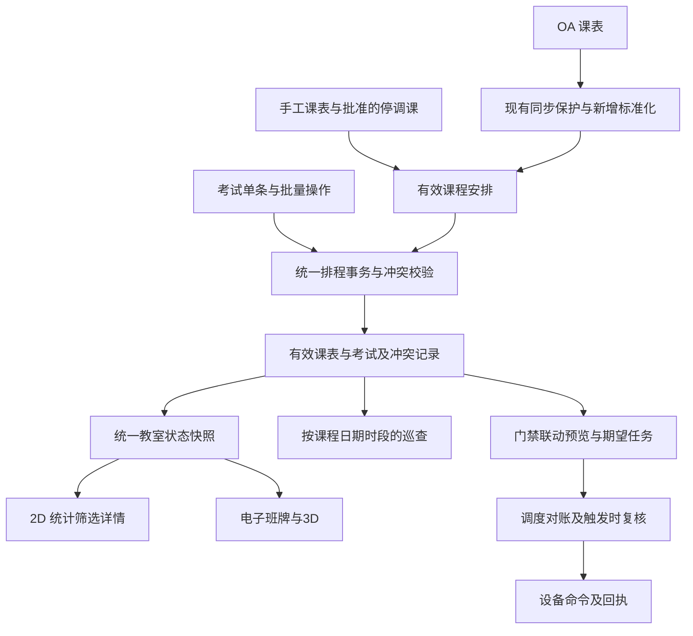

# 课表联动的考试与教室状态业务一致性整改计划书

日期：2026-10-05。文档状态：待实施的整改计划。

本计划以[原检查报告](D:/CodingFiles/School/assessment-back-v2/assessment/doc/todo/考试与教室状态及前后端业务一致性检查-2026-10-05.md)的 B01–B27 为问题清单，并重新核对当前前后端工作区。目标是让项目现有课表成为教学安排依据，将考试、教室占用、班牌、门锁调度及巡查纳入同一套时间和资源规则，形成能够实施和验收的闭环。

**本次仅新增本计划书。以下接口、字段、服务、迁移和测试均为未来实施建议，不代表已经修复；不修改原报告及前后端代码，不连接业务数据库、OA 或真实设备。** 工作区已有未提交修改按当前内容审查，不重置、不覆盖。

## 1. 复核结论与实施基线

### 1.1 关键结论

1. 原报告的主因成立：2D 用课程推导 `isActive`，考试只参与样式和部分筛选。新增考试的 `status` 改为 1 不能解决“考试中仍显示空闲”。
2. 现有课表可以联动，但当前还是 OA 原始日期、节次、教室号数据，必须先转换为可比较的教室时间区间。只在前端增加一次“是否有考试”判断，无法解决重复排程、课间差异、同步覆盖和门锁错误。
3. 现有课表同步已有数据量保护、Redis 续期租约、数据库会话锁及事务替换，应保留这些成果。新增联动必须覆盖课表手工写入、OA 同步和考试全部写入口；当前同步锁并未保护其他排程写入。
4. 全量课表同步删除旧行再插入，数据库 `id` 会变化。停课、调课和巡查关联不能只绑定这个临时行号，需要稳定课程标识及历史快照。
5. 排程占用与门锁物理状态是两个维度。“空闲”不等于门已关，“上课/考试中”不等于门已开。课表联动也不能修复设备回执、Quartz 主键和次数等底层问题，必须单独完成这些整改后再启用自动设备动作。

### 1.2 本次核对的现有落点

| 当前落点 | 已核对行为 | 对计划的约束 |
| --- | --- | --- |
| [课表控制器](D:/CodingFiles/School/assessment-back-v2/assessment/soft_main/src/main/java/com/hnkjzyxy/ab/controller/CourseScheduleController.java:40) | `GET /courseSchedule/refresh` 触发同步；列表为 `POST /list`；另有手工增改删 | 区分查询与同步写入，全部排程写入口纳入统一服务 |
| [课表服务](D:/CodingFiles/School/assessment-back-v2/assessment/soft_service/src/main/java/com/hnkjzyxy/ab/service/impl/CourseScheduleServiceImpl.java:188) | 拉取后校验，再在事务内整体替换；手工新增/更新直接写库 | 扩展同步流程并统一手工写校验，不退回先清空再拉取 |
| [课表替换事务](D:/CodingFiles/School/assessment-back-v2/assessment/soft_service/src/main/java/com/hnkjzyxy/ab/service/impl/CourseScheduleServiceImpl.java:335) | 使用 `assessment:course_schedule:sync` 会话锁，提交前验证租约 | 复用锁保护思路，补上与考试写入的共同互斥协议 |
| [课表实体](D:/CodingFiles/School/assessment-back-v2/assessment/soft_model/src/main/java/com/hnkjzyxy/ab/model/CourseSchedule.java)及[Mapper](D:/CodingFiles/School/assessment-back-v2/assessment/soft_mapper/src/main/resources/mapper/CourseScheduleMapper.xml:45) | `classDate`、`classPeriod` 为字符串；按 `JSH` 联教室；查询 `boardSn` 为字符串 | 先标准化日期/节次和教室身份，不能认为已有可靠时间区间和外键 |
| [考试控制器](D:/CodingFiles/School/assessment-back-v2/assessment/soft_main/src/main/java/com/hnkjzyxy/ab/controller/ExamController.java:102)及[批量服务](D:/CodingFiles/School/assessment-back-v2/assessment/soft_service/src/main/java/com/hnkjzyxy/ab/service/impl/ExamServiceImpl.java:59) | 只检查同 SN 考试；单条与批量校验分散；批量更新排除自身而非整批 | 将课程与考试写入改成共用的事务校验，按整批最终结果判冲突 |
| [2D 页面](D:/CodingFiles/School/assessment-front/assessment-front/src/views/digitaldoor2d/index.vue:285) | 本地每分钟重算旧数据；手动同步按钮独立；课程决定占用 | 保留显式同步操作，增加只读刷新，替换全部占用消费者 |
| [班牌](D:/CodingFiles/School/assessment-front/assessment-front/src/views/eboard/index.vue:435)及[考试工具](D:/CodingFiles/School/assessment-front/assessment-front/src/util/exam.js:19) | 班牌自行展开节次；选择器兼取当前/未来考试；跨日失败后日期已记为已加载 | 统一时间区间、分开当前和未来安排、修复失败重试和自动切换 |
| [Quartz 配置](D:/CodingFiles/School/assessment-back-v2/assessment/soft_main/src/main/java/com/hnkjzyxy/ab/config/QuartzConfig.java:39)、[恢复器](D:/CodingFiles/School/assessment-back-v2/assessment/soft_main/src/main/java/com/hnkjzyxy/ab/init/ScheduleLoad.java:49) | Job 身份按锁 ID；恢复星期逐字符解析；通道取 `remarks` | 自动课表门禁依赖调度与设备契约先修复 |
| [巡查保存](D:/CodingFiles/School/assessment-back-v2/assessment/soft_main/src/main/java/com/hnkjzyxy/ab/controller/ScheduleController.java:99) | 新增/编辑都按“今天”取 OA 请假并覆盖人数 | 按巡查对应的课表日期和时段取数据，历史快照不可被今天覆盖 |

注意：[既有 T-01 方案](D:/CodingFiles/School/assessment-back-v2/assessment/doc/todo/T-01-课表同步清空风险-完整解决方案.md)的部分旧示例仍写着 Redis 不可用时单机降级、静态 OA 客户端和公开 GET 同步。当前源码已经采用注入的 `OaApiClient`、Redis 不可用放弃同步及事务会话锁。本计划以当前源码为基线，不照搬旧示例。

## 2. 整改目标与业务规则

### 2.1 最终应达到的行为

- 排考时直接看到目标教室的课表占用；任何新增、修改、批量排考或考试重新启用都不能绕过课程冲突。
- 课表手工变更或 OA 同步后，考试冲突、教室状态、班牌展示和已有联动任务可追踪地更新。
- 2D、班牌及开放的 3D 业务页面使用同一份后端教室状态，未来预约不计入当前占用。
- 停课/调课后的有效课表参与排程；同步不抹掉本地已批准的调整，不用“考试优先”掩盖双重占用。
- 缺数据、解析失败、关联歧义显示未知或冲突；人数没有来源时不填造假的 0 或默认 50。
- 门锁指令结果以回执或明确的可验证状态为依据；自动动作按有效排程执行，取消、延长和重启能够收敛。

### 2.2 建议规则与默认处理

**用户已明确的强制规则：有课的时候不能安排考试。** 同一教室的考试拟定区间，只要与有效课表的任一课程占用区间冲突，就必须拒绝安排。考试完全包含课程、课程完全包含考试、部分交叉及跨日交叉均需检查，不能只比较考试开始时刻是否在上课。

该规则适用于单条新增、单条修改（包括延长时间、换教室）、批量新增、批量修改及考试重新启用；管理员和批量接口同样不能绕过。前端提示与后端事务内校验同时落实，直接调用 API 也不得写入。批次中任一条与课程冲突时整批拒绝，不保存其中部分记录。

**排考不提供“考试优先”“审批覆盖课程”“强制排考”或自动停课/调课来绕过规则的选项。** 应优先更换考试教室或时间。课表管理中的真实停课/调课作为独立业务办理并生效后，排考仍须重新读取最新有效课表，只有目标教室和整个目标区间已无课程占用才可提交；提交考试本身不能同时取消课程以制造空档。

无法完整取得课表、教室关联存在歧义或节次无法解析时，不得认定“无课”并放行考试，应提示“课表状态无法确认，请刷新或处理后重试”。课间按课程占用规则保留的区间也禁止排考。

以下其余规则是实施建议，尚未成为已确认的校方制度。实施前由业务负责人固定规则和版本；上述“有课不能安排考试”已经明确，不再列为待确认事项。

| 事项 | 建议规则 | 暂未确定时的处理 |
| --- | --- | --- |
| 学校时间 | 统一 `Asia/Shanghai`；接口用带 `+08:00` 的 ISO 时间和 `serverNow` | 禁止按浏览器本地时区隐式解析无时区字符串 |
| 当前占用边界 | `start <= now < end`，结束瞬间解除该安排占用 | 按秒判断，不把整分钟延长至下一分钟 |
| 相邻排程冲突 | 第一阶段保留现有考试“端点相接也冲突”规则，并明确应用于新增的课程/考试交叉校验 | 展示区间半开与排程冲突规则分别命名；未经业务确认不放宽相邻安排 |
| 教学课间 | 建议同一连续教学安排内部课间仍保留教室，标为“教学占用（课间）” | 2D、班牌及排考共享保留区间，班牌仍可展示当前处于课间 |
| 非连续节次 | 每组连续节次单独生成占用区间，中间未排课时段不自动整段占用 | 不支持或无法解释的格式进入待处理，不猜时间 |
| 有课时安排考试 | 强制禁止；所有角色、单条/批量及直接 API 均执行同一课程冲突校验 | 不允许覆盖课程；更换考试时间或教室，课表未知时也不放行 |
| 班牌切换 | 当前有效且无冲突的考试自动进入考试页，未来只预告；结束后重新选择当前课程/考试 | 有冲突或来源未知时显示异常提示及最近确认安排 |
| 物理门禁联动 | 采用教室级配置明确开启；规则含开门提前量、关门延后量、负责人和设备通道 | 默认不新增自动门锁指令；先提供联动预览 |
| 考试内容 | 建议考试号和内容均去空白后必填，时间严格递增 | 若允许内容可选，先统一数据库和 DTO 约束 |

同一时刻课程与考试重叠、两场考试重叠、不同课程争用同教室，均应输出 `conflict`。合班或同一教学事件的多条班级数据应先识别为一个教学事件，不能把它们误判为不同课程冲突，也不能仅取第一条丢失班级人数。

## 3. 课表联动的整体设计

建议新增职责，而不是将全部业务继续堆入页面或 Controller：

| 建议职责 | 输入与输出 | 复用范围 |
| --- | --- | --- |
| `SchoolTimePolicy` / `CoursePeriodResolver` | 作息版本、课程日期和节次 → 教学区间及占用区间 | 同步、课表写入、考试校验、班牌和门禁 |
| `ClassroomBindingService` | 校区/楼栋/教室号或设备身份 → 唯一 `classroomId` | 课程、考试、班牌和门锁 |
| `EffectiveScheduleService` | OA 原始课程、本地课程及批准调整 → 有效课程事件 | 排程、查询、巡查及门禁 |
| `ScheduleConflictService` / `ScheduleWriteCoordinator` | 最终待提交安排 → 校验结果、持久化和版本 | 考试和课表全部写入口 |
| `ClassroomOccupancyService` | 教室范围、服务器时刻、可信数据版本 → 状态快照 | 2D、3D、班牌、管理预览 |
| `LockScheduleReconcileService` | 有效安排、联动策略、真实绑定 → 期望任务及对账结果 | 自动门禁和 Quartz 恢复 |

这些名称仅描述边界，实施时可合并少量服务；第一阶段不强制引入独立微服务、消息中间件或全量“占用表”。状态可从标准化课程和考试按需计算，必要时按版本缓存。

## 4. 数据身份、作息与迁移计划

### 4.1 统一教室和设备身份

1. 用现有 `sys_classroom.id` 作为内部教室身份。考试和课程补 `classroom_id`，门锁绑定使用该 ID 与独立的 `lockId`、`doorChannel`。
2. OA 当前字段有 `XQ`、`JZWMC`、`JSH`；教室字段有 `XQMC`、`JZWMC`、`JSH`。建立显式校区/楼栋映射及别名表，不能假定 `XQ` 一定等于校区名称。
3. `(校区,楼栋,教室号)` 必须能唯一定位；缺失、重复或歧义记录进入待绑定清单。不能匹配第一条，也不能把楼层当全校唯一资源身份。
4. 核实现库 `board_sn` 的语义及类型。厂家 SN 统一为保留大小写、字母、前导零的字符串；若旧整数是内部班牌编号，则保留为独立旧字段，另设真实 SN。前端去除设备 SN 的 `Number()` 转换和正整数限制。
5. 教室列表不以一对多门锁 JOIN 复制教室行；占用统计按 `classroomId` 去重，门锁列表独立返回。考试查询使用明确列，避免 `SELECT *` 联表同名列污染主键和状态。
6. 在绑定完成后才逐步增加索引、唯一约束和必要的非空约束；不能先强制约束再把迁移失败记录绑定到任意教室。

排考按教室选择，无班牌的合法教室仍可安排考试；班牌展示和自动门禁分别要求完整设备绑定，不继续用“已配置正整数 SN”代表“可排考教室”。

### 4.2 作息与课程标准化

- 将官方逐节作息作为带生效日期、校区适用范围和版本的配置。当前两页面只有部分奇数起点/偶数终点，不能据此推测完整单节时间。
- 标准化 `yyyyMMdd`、业务允许的分隔日期及 `SKJC`；对单节、连续节和多段节次建立固定语法。未知格式保留原值、原因及影响日期/教室，待人工处理。
- 同时产生 `teachingIntervals` 和 `occupancyIntervals`：前者用于课程正在授课/课间说明，后者用于教室保留、排考及门禁。
- 例如现有 `1-4` 的大时段为 08:20–11:50，建议 10:00 保留为教学占用并显示课间；实际逐节授课区间仍须由官方作息确认。班牌不得显示可借用，2D 不再产生不同占用结论。
- 作息版本变化必须重新计算受影响课程、课程/考试冲突及门禁任务，作为排程变更走共同锁与审计，不直接热改后绕过冲突检查。
- 考试跨午夜时按真实起止区间与覆盖日期的课程比较；查询当前考试不能只按“开始日期是今天”过滤。

### 4.3 稳定课程标识与本地调整

优先向 OA 核实是否能提供课程发生实例 ID、班级 ID 和更新时间；当前转换器未映射这些稳定 ID，不能在计划中假定已有。为有效课程分配内部稳定 `courseKey`，把数据库行 ID 作为存储细节。

如 OA 没有稳定实例 ID，先确定可验证的来源业务键及映射登记。含日期、节次、教室等可变字段的哈希只能去重或定位某一版本，**不能保证调课后仍是同一课程**。对候选变化进行差异匹配；多义、拆分、合并或无法唯一对应时转人工确认，调整标为待复核，不自动把旧停课关系套到另一条课程。

建议将 OA 基础课表、本地新增课程、批准的 `CANCEL/MOVE` 调整分开保存，有效课表通过三者合成。每个调整记录课程稳定键、适用日期/区间、调整前后、审批人/时间、理由及来源版本。OA 全量替换只更新来源层，不清除本地层和调整层；不提供通过考试提交创建 `REPLACE` 调整来覆盖课程的功能。

课表独立调整流程：课表管理提交并批准真实停课/调课 → 校验调课目标的课程及考试 → 发布有效课表和版本。后续排考作为另一次独立提交，重新检查目标教室整个区间是否无课；仍有课程就拒绝，不使用审批记录豁免校验。恢复课程同样检查已有课程和考试；与考试冲突时进入待处理，优先调整考试，不静默强行恢复或撤销课程。

### 4.4 建议的持久化增量

| 数据对象 | 建议新增内容 | 目的 |
| --- | --- | --- |
| 教室及绑定 | 真实容量、规范位置键；教室与班牌/锁/通道关系 | 唯一资源定位、真实容量和设备绑定 |
| 课表来源及本地课程 | `classroomId`、`courseKey`、来源标识、来源版本、解析状态、作息版本 | 同步后仍能定位课程，区分原始与有效数据 |
| 课表调整记录 | 动作、课程身份、旧/新安排、审批和关联考试 | 停调课不被同步清除 |
| 考试 | `classroomId`、控制状态、实际提前结束时间和行版本 | 业务控制、时间推导和并发编辑 |
| 同步历史及排程版本 | 同步批次、有效/无效行、覆盖范围、最近成功时间、全局 `scheduleVersion` | 持久化可信度和跨端一致快照 |
| 冲突记录 | 双方来源/稳定 ID/版本、教室、区间、处理状态及结果 | OA 引入冲突可追踪、可关闭、可复核 |
| 门禁任务及命令 | 真实任务 ID、来源安排/版本、通道、次数、期望/实际状态、命令 ID/回执 | 调度对账和防重复执行 |

上述是逻辑对象，具体是否新建表由现库结构确定。DDL、回填和回滚脚本在未来实施阶段单独交付，本计划不执行 SQL；迁移不可直接运行带 `DROP TABLE` 的历史 dump。

## 5. 排考、课表变更与 OA 同步的双向联动

### 5.1 考试及手工课表写入

所有新增、编辑、批量、取消/提前结束、重新启用、删除、停调课及绑定/作息变更，按以下顺序执行：

1. 验证认证用户和资源范围；检查 DTO、空元素、重复 ID 和请求大小。客户端预览只作辅助，最终提交重新验证。
2. 进入事务取得共同排程锁后，读取最新旧记录及版本，再合并部分更新；不能先读旧数据、后加锁而不复核。
3. 形成本批最终安排；修改教室时纳入原、新教室，区间采用同一学校时区和作息规则。
4. 检查教室存在、唯一绑定、时间严格递增、枚举、长度及必填字段；无效节次、缺覆盖数据或未解析安排影响目标区间时，返回“无法确认可用”，不能判空闲。
5. 查询有效课程和有效考试。数据库考试比较排除本批全部待更新 ID，再检查本批最终结果；失效/取消安排不占未来资源，提前结束采用真实结束时刻。历史已发生的占用保留审计。
6. 任一课程/考试冲突整批拒绝，任何角色不得覆盖课程或在排考提交中自动停课；合法换时/换教室整批成功。冲突返回双方类型、课程/考试名称、教室、时间和批次行号，明确提示“该教室此时段有课程，不能安排考试，请更换时间或教室”。
7. 原子保存业务记录、调整、冲突处理结果、审计及排程版本；批量保存返回失败或影响行数异常必须显式回滚，不能以返回错误文本代替事务回滚。
8. 提交后使缓存失效，通知刷新或写入待处理联动事件。Quartz 和设备命令不在持有排程锁的事务中同步执行。

采用行版本防止两个管理员互相覆盖修改。新增及批量提交可使用幂等请求键，网络超时后先查询回执，不自动重复新增；同一个键提交不同内容应拒绝。

### 5.2 并发保护的具体方案

第一阶段建议将现有数据库会话锁 `assessment:course_schedule:sync` 扩展为所有排程写入的共同锁协议，并保留 OA 同步自己的进程锁和 Redis 租约。共同锁覆盖整个“读取最新数据 → 校验 → 写入 → 提交/回滚”，手工考试写入不依赖 Redis 即可获得与同步的互斥。

这是低改动的初始串行方案，**不同教室的写入也可能短暂等待或返回忙碌**，不能宣称已经实现按教室并行。OA 拉取和初步解析放在共同锁之外；占锁后基于最新考试、本地调整、教室绑定和作息版本重新计算冲突。锁忙返回明确可重试结果，不执行半批写入。

用独立测试连接验证加锁后读到前一事务已提交数据；避免 MySQL 可重复读事务先建立旧快照再用旧数据校验，可选使用明确的当前读或适当隔离级别。会话锁必须与事务使用同一数据库连接，并延续现有事务完成后释放的处理。

如后续吞吐要求按教室并行，再迁移为“全局同步/配置变更屏障 + 按稳定教室 ID 排序的资源锁”。同步必须与全部相关教室写入互斥；换教室同时锁旧、新资源。普通唯一索引不能代替区间排他校验。混合版本实例仍可能绕过协议，上线需先统一全部写入口。

### 5.3 OA 同步流程

1. 复用现有锁、拉取、结构/分页/数据量保护；分页能力不足时继续拒绝疑似截断数据，不降低阈值掩盖缺页。
2. 增加日期/节次、教室唯一映射、重复课程及课程身份校验，输出逐行问题。当前仅校验课程名/班级名/日期非空并跳过坏行，不足以证明某教室没有课程。
3. 能明确定位日期/教室的坏行进入待处理并标记其范围不可判空闲；定位范围也不明时，本轮不发布为可信课表，保留上一有效版本并报告失败。不得通过跳过坏行制造可排考空档。
4. 锁内以最新考试和本地调整合成候选有效课表，校验来源版本是否改变；若改变则重算。OA 内部课程重叠也需输出，不只检测课程与考试。
5. 推荐对结构完整、身份可判定但存在排程冲突的新 OA 版本照实发布，同一事务保存冲突及异常范围。保留考试记录，标记受影响安排待处理，不静默取消考试或伪造停课；相关区间的新增排程拒绝，自动门禁进入暂停/复核。
6. 课程发布、调整关联状态、冲突记录和版本更新整体提交；任一步失败保留旧版本。发布失败、跳过和“发布成功但有冲突”是不同结果。
7. 提交后刷新状态缓存和联动期望任务；只发布实际差异，避免每天同步生成重复开锁任务。Redis 最近结果继续保留，同时增加持久化历史；缓存写失败不应撤销已成功提交的课表。

同步结果建议增加 `syncId`、`scheduleVersion`、`invalidRows`、`unmappedRows`、`conflictCount`、`affectedClassroomIds`、`publishedWithConflicts`、覆盖日期及问题清单入口。保留当前 `executed/success/totalRows/validRows/savedRows/previousRows/costMillis/message`；锁忙、开关关闭也返回结构化结果，便于前端区分。

### 5.4 冲突处理闭环

冲突清单支持按教室、日期、课程/考试和负责人筛选。课程与考试冲突时，优先更换考试时间/教室或取消考试，不提供课程覆盖选项。确有课表错误或独立停调课业务时，在课表管理中修正并发布，再重新校验；处理动作走统一事务。确认冲突消失才标记解决，新版本再次冲突需重新打开或建立关联，不能用旧“已处理”状态压掉新问题。

未来冲突不会直接把今天空闲教室标成当前冲突，但应显示预约冲突提示并阻止该未来时段的新排程。

## 6. 统一状态与接口契约

### 6.1 教室状态计算

后端在同一读快照和一个 `serverNow` 下计算当前范围；不能分别读取课程、考试和版本后拼成混合版本。可使用短只读事务一致读取，或读取前后版本不一致时重试。

| 条件 | `occupancyStatus` | 展示 |
| --- | --- | --- |
| 当前已知有效安排互相冲突 | `conflict` | 排程冲突，展示双方 |
| 相关来源不完整、超期或身份/节次不可判定 | `unknown` | 状态待确认；保留最近确认信息及异常原因 |
| 当前只有有效考试，相关来源可信 | `examining` | 考试中 |
| 当前只有有效课程保留区间，相关来源可信 | `teaching` | 上课中，或教学占用（课间） |
| 相关来源可信且当前均无安排 | `idle` | 空闲 |

已知考试占用而课程来源不完整时，保留 `knownOccupied=true` 和考试详情，但不能承诺“无课程冲突”；主状态按未知处理并禁止作为空闲候选。教室重复设备数据不重复计数。

汇总分别计教学、考试、冲突、未知和空闲；房间数应覆盖且互斥。推荐 `已确认占用率 = 已确认被占用的教室数 / 教室总数`，已知占用集合包括冲突及未知中的确定占用，按教室去重，并同时展示未知教室数量及“数据不完整”标识。未知不增加空闲数量；座位计划占比独立计算，不混同教室使用率。

考试控制状态建议为 `ACTIVE/CANCELLED/ENDED_EARLY`，时间派生为 `UPCOMING/ONGOING/FINISHED`，并附排程冲突信息。兼容旧 0/1/2 时，未来/当前/过期统一按时间派生；旧 `status=2` 不能擅自重新激活。历史 2 是否人工结束需据审计或人工复核迁移，不凭时间猜测。恢复已结束记录必须明确授权并重新校验。

### 6.2 建议接口

以下为逻辑路径，最终统一 `/api` 前缀由现有上下文/网关确定；不要额外拼出重复前缀。

| 接口建议 | 用途与约束 |
| --- | --- |
| `GET /classroom/occupancy` | 管理端按校区/楼栋范围获取批量当前状态，包含 `serverNow`、学校时区、数据版本和可信度 |
| `GET /board/schedule/current` | 由设备身份定位绑定教室，返回当前/下一课程、当前/下一考试、模式建议及独立门锁状态 |
| `GET /classroom/{id}/schedule?from=...&to=...` | 排考预览指定日期范围的课程/考试/冲突；按重叠查询，覆盖跨日事件 |
| `POST /schedule/conflicts/preview` | 根据单条或批量最终安排只读检查；正式提交仍重复校验 |
| `POST /courseSchedule/sync` | 有权限的显式 OA 同步，返回执行/发布/问题明细 |
| `GET /courseSchedule/sync/{syncId}` | 查询同步历史及问题，不重复触发写入 |
| 既有考试单条/批量接口 | 保留入口，内部转统一服务；逐步支持教室 ID、版本与控制状态 |
| 课表调整及冲突处理接口 | 独立权限、理由和审计；不能用普通课表删除代替停课审批 |

成功空列表统一 `code=200,data=[]`；不存在的实体、无安排、查询失败和没有权限分别表示。现有考试列表将空列表返回“考场不存在”，前端有专门兜底，迁移时共同更新，不扩展成“所有错误都当空数组”。

快照至少包含：`classroomId`、原样 SN、`serverNow`、`timezone`、`scheduleVersion`、`occupancyStatus`、`knownOccupied`、`currentCourses/currentExams`、`nextCourse/nextExam`、`teachingPhase`、`nextBoundaryAt`、`conflicts`、来源可信度和最近成功加载时间。业务有效时间与设备 `observedAt/confirmedAt` 独立。

前端在轮询之间可用服务器时间偏移和已知边界更新倒计时/临时展示，到边界发起只读刷新。时间变化不依赖 `scheduleVersion` 增长；版本未变也要返回或重算当前状态。设备时钟漂移、页面后台恢复后重新校准。

## 7. 前端实施计划

### 7.1 2D 与考试管理

- 全面替换卡片、详情、统计、楼层汇总、颜色和筛选对课程布尔值的依赖；统一由状态快照渲染。考试中显示考试内容，冲突显示异常，未知不得进入空闲筛选。
- 分开“当前考试中”“未来有预约”筛选；删除 `hasActiveExam` 直接调用兼取未来考试选择器的做法。共享工具分出当前考试、下一考试和展示预告。
- 新增/编辑/批量组件按教室 ID 选择目标，选择时间后展示该教室课表和考试；有课时禁用正常提交并显示冲突课程、日期和时间，提示更换考试教室或时间。后端仍独立强制校验，不因前端按钮状态或管理员身份放行。
- 批量组件支持合法换时，不继续提示用户拆成两次提交规避旧算法；最终版本不合法时准确定位批次行号。
- 真实容量缺失显示“未知”；考试计划人数单独提供时才计算座位计划占比，不借用当前课程人数。

### 7.2 班牌与 3D

- 班牌持续获取绑定教室统一快照，自动选择有效当前模式；取消、提前结束、延长、连续考试、跨日和切换设备均重新决策。
- 班牌保留课表列表，但使用后端标准化时间和课间规则，删除本地两节展开作为业务权威的做法。只有成功读取才更新已加载日期；失败仍重试。
- 人工临时展示与业务占用分开。固定前端密码不作为排考、同步或设备权限边界，人工模式也不能篡改排程状态。
- 门锁状态采用独立字段和确认时间，不初始化为确定锁定，不按本地布尔值取反。更换设备时清掉旧请求、状态和按钮能力。
- [3D 组件](D:/CodingFiles/School/assessment-front/assessment-front/src/views/smartdigitaldoor/components/ThreeClassroom.vue)如继续作为业务入口，消费同一快照，仅保留空间布局；如保留样例用途则标识演示并与正式状态查询隔离。运行时菜单是否开放需联调核实。

### 7.3 刷新与可信度

第一阶段采用只读轮询，建议正常 30 秒一次；班牌确有更快需求时可配置 10 秒，需结合设备规模压测。页面重新可见、网络恢复、写入成功和状态边界立即刷新；失败采用带抖动的退避并保证恢复后持续读取，组件销毁时清理。

请求防重入、设置超时并以序号丢弃旧响应；复用现有部分页面的版本保护。轮询只查业务库，不触发 OA 同步或设备命令。未来 SSE 可通知版本变化，但仍保留边界重算和断线后读取。

建议页面快照超过 120 秒无成功刷新时标为陈旧。OA 课表有独立同步可信度：现有默认每日 03:00 同步，不能用“API 刚返回”冒充“OA 数据刚同步”。可初设超过 36 小时未成功同步告警并将无法保证的空档标为待确认，最终阈值由同步 SLA 和学期覆盖范围确定。同步定时器应显式学校时区，当前 `@Scheduled` 未指定 `zone`，不应依赖部署机器时区。

## 8. 门锁与调度整改及课表联动

### 8.1 先修复底层一致性

| 对应问题 | 必须完成的整改 | 验收核心 |
| --- | --- | --- |
| B16–B18 | 按唯一教室/锁/通道绑定发命令；不以 `lockId` 兜底 SN；区分命令接收、失败、未知与设备确认，成功回执后更新确认状态 | 命令发送失败不显示已开门；无回执显示待确认；页面读取真实最新状态 |
| B19、B21 | Job/Trigger 按真实 `taskId` 命名；新增回填主键，创建人来自认证用户；注册只读取持久化配置 | 同锁多任务共存；数据库、Quartz、日志 taskId/用户相同 |
| B20、B25 | 星期按整数 JSON 数组统一解析和范围校验；保留 `0=周一…6=周日` 契约；拆 `doorChannel` 与描述 | 重启不增加周一，描述不进入通道解析 |
| B22、B24、B25 | 状态切换 DTO 只改状态；独立 `unlimited` 和正整数次数；成功确认按真实任务 ID 幂等记数 | 启停不清零，有限次数耗尽停用，通信失败按已固定策略处理 |
| B23 | 数据库保存期望状态，调度服务幂等创建/更新/取消，启动及周期对账；返回待同步/已同步/失败 | 注册失败可恢复，重复取消一致，停用后不再触发 |

失败重试策略必须固定：至少保存命令 ID、尝试结果和回执关联。一次业务执行的重试不得多次扣成功次数；服务重启不从易失 JobDataMap 重置有限次数。若设备只能确认指令接收而无门磁/物理回执，界面应写“指令已确认”，不能冒称物理门已开。

### 8.2 课表及考试生成门禁计划

在底层通过验收后，为开启联动的教室生成一次性时间任务：`有效课程或考试 + 提前/延后策略 + 设备绑定 → 开/关门期望动作`。当前每周 Cron 任务保留为独立手工功能，不用星期数组模拟有具体日期的课程、跨日考试及停课。

- 任务关联 `sourceType/sourceId/sourceVersion/classroomId/lockId/doorChannel/action/scheduledAt`。同一来源、版本、动作和设备建立幂等身份；安排新版本取消旧未来任务再创建新任务。
- 连续有效课程/考试先合并门禁保留窗口，避免上一安排关门和下一安排开门相互争抢。占用的相邻冲突规则和门禁窗口合并是不同规则，不能因合并而允许非法排程。
- 触发时重新查询最新来源状态和版本、冲突、绑定及策略；已取消、变更、数据不可信或过期任务不执行。旧 Job 未及时取消也必须被触发复核挡住。
- 安排取消只撤销尚未执行任务，不自动“撤销已开门”；自动关门需校验仍无其他保留安排、可执行的设备状态与业务安全条件。手工覆盖要有期限和审计，并由对账识别。
- 服务停机后不补发已经错过的历史关门指令；按学校策略重新生成未来动作，必要时提示人工检查当前门状态。多个任务的冲突及手工优先规则写入策略。
- 排程事务只持久化期望任务或事务事件；Quartz 同步失败进入待同步并重试。Redis 丢失不应丢掉任务来源和对账依据。

先交付“课表/考试对应门禁动作预览、模拟网关验证和联动差异清单”，再在少量已完成绑定的教室启用；本计划阶段不执行真实设备动作。

## 9. 巡查与人数数据的课表联动

1. 巡查录入按选择的日期、教室和课程事件定位有效课表，带入课程、教师、班级及节次；允许无课表补录时填写来源与理由，不能自动匹配第一条同名班级。
2. 巡查保存课程稳定键、当日时间区间及课程/班级信息快照。OA 后续删除或调课不改写已有巡查历史；调课导致关联多义时提示人工复核。
3. 请假查询按巡查日期和时段，使用稳定班级/学生身份及有效请假区间去重。当前 OA 查询接口是否支持历史条件及稳定 ID，需要联调验证；名称映射只能采用明确且唯一的已核实别名。
4. 不支持历史查询时保留已保存请假值，或允许带来源的人工确认；响应错误、非数组或未知粒度不能写成 0，也不能覆盖历史人数。
5. 区分班级人数、应到、预计到课、签到/巡查实到及请假；班级人数减请假仅标预计到课。班牌“实到”需要当时段签到或巡查真实来源，附时间与来源。
6. 课表管理中已独立批准取消的教学区间不继续自动产生教学巡查要求；排考不能自动取消教学巡查。考试巡查如需支持，作为独立类型，不复用课程人数制造出勤数据。

## 10. 权限与审计计划

优先整改[生产白名单](D:/CodingFiles/School/assessment-back-v2/assessment/soft_main/src/main/resources/application-prd.yml:121)中的考试、课表整路径放行。按具体路径和 HTTP 方法定义权限，而非认为 POST 都是写入：现有列表为 POST，只读接口仍需按管理端/设备端分别限定范围。

- 排考、考试状态、删除、课表手工写、OA 同步、停调课审批、冲突处理和门禁启用均做服务端权限及教室/校区范围校验。
- 班牌使用设备身份获取绑定教室的只读内容和授权能力，不能任意更换请求 SN 跨教室读取/控制；门锁控制单独授权。
- GET 同步迁移为受保护的 POST。兼容期旧 GET 至少同等鉴权和审计、仅显式人工触发；完成前端迁移后关闭，不能留在公开白名单。
- 操作者从认证上下文取，不信任客户端 `userId`。审计记录来源、变更前后、资源、批准关系、请求 ID、结果及版本；同步按批次记录差异，不打印密钥或完整学生敏感报文。

## 11. 分阶段实施与交付物

人日仅为工作量预估，假设一名熟悉后端和一名前端开发配合，不包含等待校方、OA 或设备厂商响应的时间；各阶段有依赖，不能简单相加推导上线日期。

| 阶段 | 工作内容 | 预计工作量 | 阶段出口 |
| --- | --- | --- | --- |
| P0 基线与规则 | 现库类型/重复绑定、OA 稳定 ID 与历史能力、官方作息、业务规则、有效部署权限核实 | 2–3 人日 | 数据核查清单、字段映射、规则版本和迁移样本 |
| P1 权限与统一写入 | 收紧写权限、统一 DTO/事务、共同锁、整批最终结果校验、规范空列表 | 3–5 人日 | 直接 API 非法输入不能写；并发及合法换时用例通过 |
| P2 课表核心联动 | 教室/课程稳定身份、标准区间、独立调整层、双向冲突、同步冲突历史与版本 | 5–8 人日 | 有课时所有排考入口均拒绝；课表独立调整可审计；同步安全且冲突可处理 |
| P3 状态与前端 | 统一状态接口、2D 全部消费者、班牌自动切换、只读刷新、真实人数语义、3D 接入/演示标识 | 4–6 人日 | 截图场景及开始/结束/跨日/失败场景跨端一致 |
| P4 门禁与调度 | 修复任务身份/星期/通道/次数/状态机及回执；生成联动预览、一次性任务和对账 | 5–8 人日 | 模拟设备与重启故障验收通过，具备小范围启用条件 |
| P5 巡查与发布 | 日期/时段请假、历史快照、迁移复核、联合验收和灰度观察 | 3–5 人日 | 原问题矩阵逐项关闭或留下明确外部依赖与处理人 |

P1 的课程冲突校验依赖 P2 标准化能力，二者可分批交付，但未完成 P2 前不得宣布 B07 已解决。权限和校验可先落地；截图显示问题通过 P3 解决，无需等待真实门禁联调。P4 的模拟整改可在 P2/P3 期间推进，自动课表指令启用必须在相关依赖通过后进行。

建议实施落点：后端以现有 CourseSchedule/Exam Controller、Service、Mapper、Model 为主，扩展统一时间、身份、冲突、状态和调度职责；前端集中修改 2D、班牌、ExamBatchManager、考试/课表工具、门锁管理及定时页、巡查录入和 3D 组件。保持当前 Vue 2 / webpack 项目方式，不将框架升级混入本次整改。

## 12. 验收矩阵

以下均是后续实施时要执行的用例，本次未运行服务、数据库或设备测试；原报告记录的 64/64 是当次 mock 测试结果，不作为本计划修复后的验证结果。

| 编号 | 场景 | 必须断言 |
| --- | --- | --- |
| A01 | 固定上海时间 2026-10-05 01:05:30，考试 01:04–04:05，无课程 | 2D/班牌为考试中；不进空闲筛选；考试及占用统计增加；04:05:00 解除 |
| A02 | 五天后有考试，今天无课程 | 当前空闲，未来预约单独显示；当前考试筛选不选中 |
| A03 | 同一天 `1-4` 的 10:00 课间 | 按已固定课间规则，2D/班牌/冲突校验/门禁区间一致 |
| A04 | 单节、`2-3`、多段、未知节次、结束瞬间 | 合法输入按官方配置解析；未知进入待处理并阻止错误空闲判断 |
| A05 | 有课时单条/批量新增、修改、延长、换教室或重新启用考试；管理员直调 API | 全部拒绝并返回冲突课程和区间；批次整批无写入；不提供覆盖课程或自动停调课选项 |
| A06 | 合法批量互换时间/教室、重复 ID、最终仍重叠 | 合法整批成功；重复/最终冲突整批回滚；校验不比较同批旧安排 |
| A07 | 同教室两请求并发排考；考试与手工课表/OA 发布并发 | 普通重叠新增最多一个成功；同步引入冲突须原子记录并禁用相关自动动作，无静默双重占用 |
| A08 | 提交半途数据库写失败、锁租约丢失、Redis 不可用、同步锁忙 | 无半批；旧课表逐行保留；失败/跳过有结构化原因；设备不执行 |
| A09 | OA 无效节次/歧义教室/疑似截断/新课表冲突 | 不发布假空闲；坏数据处理符合范围策略；业务冲突照实发布并可追踪 |
| A10 | 已批准停课/调课后再次全量同步，来源 ID/内容改变 | 调整不被清空；稳定匹配有效；多义进入待复核且不误套课程 |
| A11 | 独立停调课生效后排考；恢复课程时目标已被考试占用 | 排考重新读取最新课表，只有整个区间无课才成功；恢复冲突可见，优先调整考试，不强制覆盖 |
| A12 | 两校区均有 101、同室多锁、字母 SN 和前导零 | 课程、考试、锁准确绑定；教室不重复计数；SN 原样贯通 |
| A13 | 当前/过期考试持久化仍为 0，旧 2，提前结束后重启 | 按时间统一派生；旧 2 不复活；提前结束不继续占用 |
| A14 | A 窗口修改，B 2D/班牌持续打开；取消/延长/连续考试 | 正常在配置轮询周期及网络容差内更新，边界及时切换，不用旧结束时间退出新安排 |
| A15 | 首次失败、快照超期、跨日读取失败、后台恢复 | 未知不计空闲；失败持续重试；成功才记已加载日期；恢复校准时间 |
| A16 | 上海与 UTC 浏览器，同一瞬间；部署机器 UTC | 业务日期、区间、倒计时一致；同步/调度显式学校时区 |
| A17 | 同锁多任务、星期 `[2,4]`、周日、编辑启停、次数耗尽 | Job 不覆盖；重启语义不变；通道和次数保留；耗尽按 taskId 完成 |
| A18 | 注册失败、重复取消、错过触发、旧版本 Job、重复回执 | DB/Quartz 最终收敛；旧任务被挡；不补发历史危险动作；同次成功仅记一次 |
| A19 | 设备命令失败/超时、其他窗口开门、绑定被更换 | 不报告物理成功；页面状态同步；不发往旧设备或 SN 兜底设备 |
| A20 | 课程结束紧接其他安排、取消已开门安排、未启用联动 | 门禁保留窗口合理合并；取消不盲关门；未启用不产生自动命令 |
| A21 | 昨日补录/历史编辑、相似班名、重复请假、异常 OA | 按课程日期时段；历史不被今天覆盖；异常非零人数；去重和来源明确 |
| A22 | 无容量、无考试人数、只有预计到课 | 显示未知或准确名称，不造容量/实到；统计与明细口径一致 |
| A23 | 匿名/普通用户/跨校区管理员/跨 SN 班牌直调 API | 未授权写入和越界读取/控制被拒绝；授权业务范围正确 |
| A24 | 正式 3D 与 2D、班牌同一时刻 | 状态、课程/考试及版本一致；样例模式明确演示 |
| A25 | 考试包含课程、课程包含考试、部分重叠、跨日重叠、课间保留及课表查询失败 | 所有课程占用冲突均拒绝；未知不放行；不能仅检查考试开始点；相邻端点按已固定规则校验 |

验证层次：时间与解析函数的确定性测试 → 隔离 MySQL 的事务/并发/迁移测试 → 浏览器跨端验收 → Mock OA/Quartz/设备故障测试 → 已授权测试教室的真实联调。现有前端适配测试需要保留，并补充上述业务断言；只通过 mock 测试不能证明数据库锁和设备成功。

## 13. 原问题到计划的追踪表

| 原问题 | 解决落点 | 验收 |
| --- | --- | --- |
| B01 考试仍空闲 | 第 6、7 节统一占用及全部消费者 | A01、A22 |
| B02 未来预约混当前 | 第 6、7 节分离当前/未来 | A02 |
| B03 考试状态滞后 | 第 6 节控制状态与时间状态 | A13 |
| B04 旧快照及失败空闲 | 第 6、7 节一致快照、轮询、未知 | A14、A15 |
| B05 时区混用 | 第 2、4、6、7 节显式学校时间 | A16 |
| B06 节次和课间差异 | 第 2、4 节官方作息及两类区间 | A03、A04 |
| B07 课表/考试无互查 | 第 2.2 节有课禁止排考；第 5 节双向写入及同步处理 | A05、A07、A09、A25 |
| B08 并发重复排考 | 第 5.2 节共同锁及最新读取 | A07、A08 |
| B09 批量换时被旧数据拒绝 | 第 5.1 节整批最终数据 | A06 |
| B10 校验不一致 | 第 2、5、10 节统一 DTO 和服务 | A04、A06、A08、A23 |
| B11 跨校区串数据 | 第 4.1 节稳定教室关系 | A12 |
| B12 SN 类型冲突 | 第 4.1 节核实后字符串/独立编号迁移 | A12 |
| B13 容量/实到无依据 | 第 6、7、9 节真实来源 | A22 |
| B14 班牌手动模式和不刷新 | 第 7.2、7.3 节统一快照自动决策 | A13–A15 |
| B15 3D 演示数据 | 第 7.2 节真实接口或演示隔离 | A24 |
| B16 班牌本地锁状态 | 第 7.2、8 节确认状态读取 | A19 |
| B17 lockId 冒充 SN | 第 4.1、8 节唯一设备绑定 | A12、A19 |
| B18 指令即成功 | 第 8 节命令回执状态机 | A19 |
| B19 同锁任务覆盖 | 第 8.1 节按 taskId 注册 | A17 |
| B20 重启星期解析错误 | 第 8.1 节统一 JSON 数组 | A17 |
| B21 主键/创建人不一致 | 第 8.1、10 节主键回填和认证用户 | A17、A23 |
| B22 启停丢次数/通道 | 第 8.1 节状态 DTO 与持久化配置 | A17 |
| B23 DB/Quartz 不一致 | 第 8 节期望状态和对账 | A18 |
| B24 耗尽任务未完成 | 第 8.1 节真实 taskId 幂等记数 | A17、A18 |
| B25 描述当通道/次数冲突 | 第 8.1 节通道和次数独立契约 | A17 |
| B26 历史巡查与当天请假混用 | 第 9 节课程时段和历史快照 | A21 |
| B27 写路径白名单 | 第 10 节方法/资源权限和审计 | A23 |

## 14. 发布、观察与回滚

1. 在测试环境备份并核实有效配置，准备迁移前后绑定和课程身份对照、失败清单、正反向迁移验证。先加兼容字段和回填，再切换读取/写入，最后收紧约束。
2. 统一写协议发布期间不能让旧实例继续绕过校验。可在维护窗口短暂停排程写入或隔离旧实例，所有写端完成升级后再恢复；查询可保持可用。
3. 先发布后端兼容接口与权限、统一写入和身份标准化，再接入状态接口及前端；迁移期间做新旧结果只读比对，关注冲突、未知和身份映射差异。
4. 以部分校区/楼栋灰度展示和排考联动。课表门禁保持关闭，仅验证预览、调度对账和模拟设备；通过后按教室策略启用。
5. 观察同步成功与覆盖范围、未映射/未解析行、冲突数及解决时长、快照陈旧、锁等待/回滚、Quartz 差异、命令失败/未知及巡查来源异常。告警需关联教室和版本，避免只统计接口 200。
6. 回滚先关闭课表自动设备动作并撤销未执行的联动任务；保留已经发生的命令及审计。展示回滚到兼容读取时仍保留未知/冲突保护，不能回滚到匿名写和绕过锁的入口。
7. 数据结构采用新增兼容字段，稳定验证前不删旧列。恢复课表时应连同来源版本、调整、冲突和联动期望状态一起对账，不只恢复一张表造成错配；已发设备动作不能通过数据库回滚撤销。

## 15. 实施前仍需核实的事项

| 待核实事项 | 影响与处理 |
| --- | --- |
| 官方逐节作息、课间保留、相邻排程及换场缓冲 | 固定规则版本后才能确定最终边界验收，沿用保守默认不代表校方批准 |
| OA 稳定课程/班级/学生 ID、分页、更新范围、历史请假 | 决定稳定关联与历史自动取数；缺能力时登记人工映射/来源，不伪造数据 |
| 实际数据库 SN 类型、重复位置键、多设备绑定及历史 status=2 | 决定迁移方式；仅仓库 SQL 不能证明现库，歧义记录先挂起处理 |
| 课表空学期/假期的合法空数据机制 | 现有同步拒绝 0 行；需带明确学期/覆盖范围和授权确认发布“合法空”，不能全局关闭保护 |
| 校区/楼栋别名、合班数据及真实容量 | 避免错绑、虚假课程冲突和重复人数 |
| 独立停调课审批责任及课程恢复规则 | 决定课表管理流程和审计；有课不能排考已由用户明确，不得作为待确认例外放宽 |
| 设备回执能力、关门安全条件及手工覆盖优先级 | 决定状态可确认程度和联动策略；能力未核实前仅预览 |
| 多实例部署、数据库版本/隔离、Quartz 存储及实际权限配置 | 决定并发/恢复和灰度方案，以隔离环境实测为准 |

完成标准：B01–B27 均有实现或明确的外部依赖处置记录；课表变更、考试变更和异常情况下，排考校验、教室统计、班牌、调度及历史巡查能够按本计划用例验证。不能以“截图文字已改”“列表 status 变为 1”或“已有测试全部通过”单独宣告整改完成。
